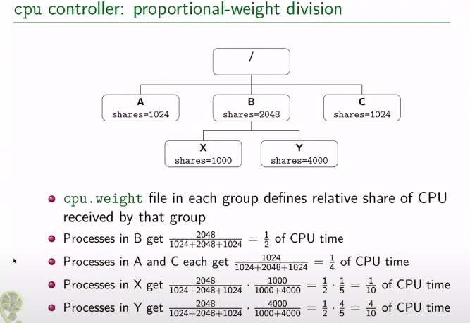

# fd (find)

在当前目录下的所有文件中寻找某字符串: `\{\}` 表示fd找到的每个文件/路径,
将其传给 `-exec` 的子命令

``` bash
fd . --type f # 文件类型 f, d ..
     --exec grep --color=always -nH  -e rust  \{\}  # -exec 对每个查找出来的文件路径执行命令
   #  其中{}代表路径, \{\} 是为了防止歧义
```

使用 `-e` 可以指定文件拓展名:

    -e rs
    -e cpp
    -e c

``` bash
fd . --type f  -e c -e rs -e cpp -x grep --color=always -i -nH -e hello \{\}
```

``` bash
find -type f -exec grep --color=always -nH -e hello \{\} +  # 对于find 的-exec子命令, {}后面需要接上加号+ !!
```

``` bash
grep --color=always -nH -i -e hello <FILE>
# -n 行号
# -H 文件名
# -e 正则表达式
# -i 忽略大小写
# --color=always 给查询结果上色
# --null 在文件名后面加上尾零.
```

# shell

## 忽略错误继续执行

``` bash
set +e 
```

恢复默认:

``` bash
set -e
```

## 退出 exit n

## 判断文件是否存在

``` bash
if [ -f $1 ]
then

else

fi
```

n\* git

# git

## 设置/取消代理

``` bash
# 设置ss
git config --global http.proxy 'socks5://127.0.0.1:1080'

git config --global https.proxy 'socks5://127.0.0.1:1080'

# 设置代理
git config --global https.proxy http://127.0.0.1:1080

git config --global https.proxy https://127.0.0.1:1080

# 取消代理
git config --global --unset http.proxy

git config --global --unset https.proxy
```

## clone 子模块

    git submodule update --init --recursive

此命令经常无速度, 可能需要手动clone, 见 `.gitmodules`

## 指定需要克隆的branch

    git clone  -b fsf-gdb-10.1-with-sim<分支>   https://github.com/riscv-collab/riscv-binutils-gdb.git riscv-gdb<别名>

# grep -i 忽略大小写

# fc-list 显示已安装字体

# docker

恢复容器的运行 :

``` bash
sudo docker start `sudo docker ps -a -q`
sudo docker attach `sudo docker ps -aq`
```

# tar fvx XXX

# du -h 以可读形式显示文件大小

``` bash
$ du -h linux-note.org 

12K linux-note.org
```

## 查看目录下的大文件

    du -sh .* * | grep G

# test命令

``` bash
test `命令` = 'str' 
test `命令` = 'string' -a `命令` = 'string'
test `命令` = "string" -o `命令` = 'string'
```

E.g

``` bash
# 判断当前平台是否是linux
test `uname -s` = 'Linux'
echo $? # 返回零表示无错误发生 
```

# pstree 查看进程树

`pstree -ap | grep mysql/redis ...`

在emacs中的shell运行pstree.

    sun@Salted-PC:saltedf.github.io [main] $ pstree -ap | grep emacs

      |           `-emacs,65 -nw .
      |               |   |-grep,217 --color=auto emacs
      |               `-{emacs},66

# strace 追踪程序的系统调用

用于debug和理解程序的流程.

``` bash
strace -f -s 65535 -i -t -T  -p <pid>    -o 输出文件 
```

有时候会输出大量信息, 根本无法分析, 若只是需要特定的系统调用,可以使用
`-e trace=` 进行过滤, 如:负责读取/接收这类的系统调用.

`-e trace=recvfrom,read,recv,recvmsg`

    strace -f -s 65535 -i -t -T -e trace=write,sendto,send  -p <PID> 

统计各个系统调用总耗时:

``` bash
strace -c <程序>

strace -c -p <PID>
```

结果显示了各个系统调用所花费总时间以及所占百分比, 调用次数,
以及出错次数. 出错越多一般代码质量越差.

``` bash

% time     seconds  usecs/call     calls    errors syscall
------ ----------- ----------- --------- --------- ----------------
 49.27    0.009506           7      1281           clock_gettime
 18.75    0.003617           9       390           rt_sigprocmask
  9.05    0.001747           9       175           ioctl
  8.12    0.001567          17        92           write
  5.40    0.001042          23        45           pselect6
  2.48    0.000478          28        17           fcntl
  2.38    0.000459          13        35           rt_sigreturn
  1.37    0.000265           6        38           read
  1.37    0.000264           7        35           timerfd_settime
  1.29    0.000249          27         9           poll
  0.37    0.000071          35         2           kill
  0.16    0.000030          15         2           getpid
  0.00    0.000000           0         2           close
  0.00    0.000000           0         2           openat
------ ----------- ----------- --------- --------- ----------------
100.00    0.019295                  2125           total

```

代码分析组合拳: strace看关键调用. ==\>
用calltree找出关键系统调用的调用关系. ==\>用IDE细看这条调用链

# objdump -D 显示可执行文件/库文件的反汇编

``` bash
objdump -D XXX | less 
```

不加less会显示太多!

# ldd 显示链接信息

``` bash
$ ldd ./build/udpclient 

    linux-vdso.so.1 (0x00007ffcb2d85000)
    libstdc++.so.6 => /lib/x86_64-linux-gnu/libstdc++.so.6 (0x00007f4c64e2a000)
    libgcc_s.so.1 => /lib/x86_64-linux-gnu/libgcc_s.so.1 (0x00007f4c64e0f000)
    libc.so.6 => /lib/x86_64-linux-gnu/libc.so.6 (0x00007f4c64c1d000)
    libm.so.6 => /lib/x86_64-linux-gnu/libm.so.6 (0x00007f4c64ace000)
    /lib64/ld-linux-x86-64.so.2 (0x00007f4c65024000)
```

# [code2html](https://github.com/agentzh/code2ebook/) 的使用

先进入项目根目录:

1.  代码转html

``` bash
src2html.pl --tab-width 4 --color --cross-reference \
            --navigator --line-numbers . <项目名>
```

1.  html合成pdf

``` bash
ebook-convert html_out/index.html llvm_release_1.pdf \
        --use-profile-size \
        --paper-size a3 \
        --pdf-default-font-size 13 \
        --pdf-mono-font-size 13 \
        --margin-left 5 --margin-right 5 \
        --margin-top 5 --margin-bottom 5 \
        --page-breaks-before='/'  
```

# wget 保存整个网站

<https://github.com/lujun9972/linux-document/blob/master/examples/10%20wget%20command%20examples.org>

    wget --mirror --convert-links --page-requisites --no-parent -P /path/to/download https://example-domain.com

但这样可能会下载不全，原因可能有很多。这里遇到的问题是默认是不跨域名下载的。

需要运行第二次，并附加上多个选项

    wget --mirror --convert-links -r -D "www.seas.upenn.edu,www.cis.upenn.edu"  -A.pdf -A.zip -A.shtml --tries=1 --timeout=8  --span-hosts  -l 5  --page-requisites --no-parent -P ./  https://www.seas.upenn.edu/\~cis341/17sp/  

- -A 指定那些没有被下载的文件类型 （需要观察网站特征获知）

- –span-hosts 跨主机名下载。

- -D 指定域名/主机名
  list，否则将遍历大量无用的域名（需要观察网站特征获知）

- –tries=1 重试一次，因为有些域名无法访问，也不含要下载的文件。

- –timeout=10 设定超时时间，防止等待太长时间。

# 配置apt软件源

``` bash
sudo vim /etc/apt/source.list

sudo apt-get update
```

# 在ArchLinux中安装deb

## debtap

## dpkg

``` bash
yay -Sy dpkg

dpkg -i  xxx.deb
```

# `Xterm` 配置文件

``` bash
cat ~/.Xresources
```

修改后使配置生效:

``` bash
xrdb  ~/.Xresources
# or: 
xrdb -merge ~/.Xresources 
```

最后重启xterm.

``` xml

! font and locale
xterm.locale: true
xterm.utf8: true
xterm*utf8Title: true
xterm*fontMenu*fontdefault*Label: Default
! 斜体在最后添加`:italic`
xterm*faceName: Sarasa Mono SC:antialias=true:style=Book
xterm*faceSize: 15
xterm*faceNameDoublesize: Sarasa Mono SC  ! Noto Sans CJK SC
xterm*renderFont: true
xterm*xftAntialias: true
xterm*cjk_width: true

! 窗口设置
! 窗口大小及位置
xterm*geometry: 80x25
xterm*dynamicColors: true
xterm*saveLines: 2048
xterm*scrollKey: true
xterm*scrollTtyOutput: false
xterm*scrollBar: true
xterm*rightScrollBar: true
xterm*jumpScroll: true
xterm*multiScroll: true
xterm*toolBar: false
xterm*Scrollbar*thickness: 10
xterm*Scrollbar*background: black
xterm*Scrollbar*foreground: gray90
xterm*background: rgb:1a/1a/1a
xterm*foreground: rgb:d6/d6/d6
xterm*cursorColor: rgb:d6/d6/d6

! 提供xterm-256color类型支持
! 如果修改后，没有得到正确的结果，说明你可能需要安装ncurses-term包来提供xterm-256color类型支持
xterm*termName: xterm-256color

! 启用 Sixel 图形支持
xterm*decTerminalID: vt340

! 配置选择文本自动复制到剪贴板
! https://askubuntu.com/questions/237942/how-does-copy-paste-work-with-xterm
xterm*selectToClipboard: true

! 启用“Ctrl+v”来复制
xterm*VT100.Translations: #override \
<Btn1Up>: select-end(CLIPBOARD,PRIMARY,CUT_BUFFER0) \n\
Ctrl <KeyPress> V: insert-selection(CLIPBOARD,PRIMARY,CUT_BUFFER0)

! 解决Alt键不好使
xterm*eightBitInput: false
xterm*altSendsEscape: true

! 配置主题
! -- Tango color scheme
xterm*color0: #2e3436
xterm*color1: #cc0000
xterm*color2: #4e9a06
xterm*color3: #c4a000
xterm*color4: #3465a4
xterm*color5: #75507b
xterm*color6: #0b939b
xterm*color7: #d3d7cf
xterm*color8: #555753
xterm*color9: #ef2929
xterm*color10: #8ae234
xterm*color11: #fce94f
xterm*color12: #729fcf
xterm*color13: #ad7fa8
xterm*color14: #00f5e9
xterm*color15: #eeeeec

```

# ssh

## 重启ssh服务

``` bash
sudo service ssh restart
```

## 查看ssh服务是否启动

``` bash
sudo lsof -i :22 
```

# 递归改变文件owner

``` bash
chown -R sun:sun ./dir
```

# 汇编文件(.s)的结构

    .text: 代码段
    .data: 常量 字符串 初始化的全局变量
    .bss: 不占用实际空间, 仅仅标记那些局部变量和未初始化的全局变量.

因为已知初值的且生命周期长的变量才有提前为它们分配空间的必要,因此data段才占用空间.
bss段中记录的是局部变量/未初始化的全局变量,
没必要一开始就为这些量准备好空间, 只要在程序实际运行时为其准备空间即可.

# makefile

## 定义变量

``` makefile
CC := gcc # 定义常量, 后续不能用+=
OBJS = hello.o world.o # 定义变量, 后续可以用+=增加
ObJS += fuck.o  
```

## 伪目标 .PHONY

通常是指那些不生成文件的. 只负责执行某些命令的.

``` makefile
.PHONY: clean  # 这个之后的target都是伪目标

clean: 
    -${RM} *.o ${target}
    echo "finish"

```

## 为整个项目添加宏定义

``` makefile

DEFS = -D_DEBUG -D_POSIX_SOURCE

FLAGS = -g ${DEFS}

```

## 为目标链接上库

``` makefile
LIBS = -lpthread -lqt

```

## 通配符

``` bash
* 所有
% :任意一个文件
? :
```

``` bash
$@ 目标
$^ 全部的依赖文件
$< 首个依赖项 
```

``` makefile
${target} : ${OBJS}
    ${CC} ${FLAGS} -o $@ $^ ${LIBS}


%.o : %.c
    ${CC} -o $@  $^ 
```

## 函数调用

``` makefile
$(my_func arg1,arg2,arg3)
```

### 当前目录下某一类型的所有文件形成的列表

``` makefile
SRC = $(wildcard *.c)  ==> hello.c world.c fuck.c  
```

### 将列表中的所有匹配项替换为指定形式

``` makefile
OBJS = $(patsubset %.c,%.o,${SRC} ) 

# 将 SRC = hello.c fuck.c 替换成 hello.o fuck.o 
```

# GDB

gef/cgdb/emacs gdb-many-windows

## 为可执行文件设置环境变量

set environment FOO = XX unset environment FOO

## 为可执行程序传参

- 进入gdb shell后:

`run arg1 arg2 ...`

`set args arg1 arg2 arg3`

- 启动gdb时通过命令行传参:

`gdb ./main --args ./main a1 a2 a3 ...`

这种方式需要额外再写一次可执行文件的路径.

## 显示某文件源代码

``` bash
l / list <函数> 
```

默认显示10行

当有多个文件时, 为了显示其中一个文件要在文件名后加 `:N` ,
否则会被视作函数名.

    list myfile.cc:1

## 添加断点

用break可以添加断点, 既能在指定行上添加,
也能为指定函数添加断点.(经常用在一行中有多个函数时)

``` gdb
break myfile.cc:100
=====================
break myfunc
```

## 查看断点

显示了断点是否被禁用, 以及断点打在何处. 每个断点都有一个ID,
对断点的操作都基于此ID


    (gdb) info breakpoints
    Num     Type           Disp Enb Address            What
    1       breakpoint     keep y   0x0000000000408d60 in test_scanner_hello_Test::TestBody() at /home/sun/src/my_compiler/mytest/test_scanner.cc:10

## 禁用断点

``` gdb
(gdb) disable breakpoints 4 
(gdb) i b
Num     Type           Disp Enb Address            What
4       breakpoint     keep n   0x0000000000408d60 in test_scanner_hello_Test::TestBody() at /home/sun/src/my_compiler/mytest/test_scanner.cc:10

```

## 重新启用断点

    (gdb) enable 4
    (gdb) i b 
    Num     Type           Disp Enb Address            What
    4       breakpoint     keep y   0x0000000000408d60 in test_scanner_hello_Test::TestBody() at /home/sun/src/my_compiler/mytest/test_scanner.cc:10

## 删除断点

用断点序号指定要删除的断点

``` gdb
(gdb) delete breakpoints 1
```

## 保存断点到文件

这个功能本身很简陋, 使用前提是源代码不能修改过. save breakpoints myfile

恢复断点: source \<myfile\>

## 单步跳过 next

不会进入函数内部.

## 继续执行, 直至遇到断点

continue

## 运行到某处,忽略期间的断点

until \<N行\> 运行下面N行, 忽略之间的断点.

## 进入到函数内部

step

## 从函数中跳出并暂停

finish

## 强制从函数中返回特定值

return 相当于一种特殊的jump, 并不会将函数体执行完.并指定一个返回值

## 跳转到指定位置继续执行

jump linenum

跳转后不会自动暂停, 需要断点.

## 显示当前所有的局部变量

info loacls

## 变量/表达式相关

### 打印变量/表达式

``` gdb
(gdb)  print tk.kind_
$2 = mycompiler::Token::INT
```

### 自动显示变量值

display 每次都将这些变量的值打印处理.

    (gdb) info display
    Auto-display expressions now in effect:
    Num Enb Expression
    1:   y  tk.kind_

### 取消对变量的自动显示

undisplay + N

### 显示变量/表达式类型

用what/whatis

``` gdb
(gdb) what tk.kind_
type = mycompiler::Token::Kind
(gdb) what 1+3
type = int
(gdb) whatis tk.kind_
type = mycompiler::Token::Kind
```

### 修改变量的值

可以在不修改源码的情况下对一些值进行设置.

    (gdb) set var tk.kind_ = mycompiler::Token::END

### 监视某变量的值

只要这个值发生改变就会自动暂停,并显示新值和旧值.

watch tk.kind\_

显示所有watchpoints info watchpoints

## 栈相关

### 显示堆栈信息: bt

### 切换栈帧

up/down: 上一层栈帧/下一层栈帧

`frame N` / `f N` 切换到指定栈帧中

## 调试已经运行的程序

首先需要获得其进程pid

attach PID

detach

## 检查点

通过fork出新的进程来保存当前运行位置和状态.

### 在当前位置添加checkpoint

checkpoint

### 查看所有checkpoints

info checkpoints

### 删除指定checkpoint

delete checkpoint N

## 线程

### 显示所有线程

info threads

### 切换到指定线程

thread N

## 以指定格式显示某地址处的内容

x/格式+长度 \<地址\>

## 反向运行

记录反向运行所需信息

target record-full

reverse-next reverse-XXX

# valgrind

## 无法使用, 报错

1.  首先尝试更新系统到最新, 然后重启

<!-- -->

    sudo pacman -Syu

    sudo reboot

1.  否则可以试下安装 `glibc-debug`

在 `/etc/pacman.conf` 中临时启用:

    [system-debug]
    Server = https://debuginfod.artixlinux.org/$repo/os/$arch
    [world-debug]
    Server = https://debuginfod.artixlinux.org/$repo/os/$arch
    [galaxy-debug]
    Server = https://debuginfod.artixlinux.org/$repo/os/$arch
    [lib32-debug]
    Server = https://debuginfod.artixlinux.org/$repo/os/$arch

<https://www.reddit.com/r/artixlinux/comments/wpji7m/valgrind_cant_load_debug_info/>

    sudo pacman -Sy glibc-debug

# [CMake](./cmake-learning.org)

``` cmake
cmake_minimum_required(VERSION 3.21)
project(word-count C)

# 设置编译器
set(CMAKE_C_STANDARD 99)
set(CMAKE_C_STANDARD_REQUIRED ON)
set(CMAKE_C_COMPILER clang)

add_compile_options(
"-ggdb" # gdb调试支持
"-m64"  
) 
# add_compile_definitions(LINE_COUNT) # 宏定义
## add_compile_definitions(MACRO_CONSTANT_NAME=macro_value)

# 生成 compile_commands.json 文件  for clangd
set(CMAKE_EXPORT_COMPILE_COMMANDS ON)

include_directories(./include) # 头文件目录

add_executable(test_strcmp.bin)
target_sources(test_strcmp.bin PRIVATE
  ./test_strcmp.c
  ./str_cmp.c
)

# target_compile_options(test_strcmp.bin PRIVATE -ggdb)
# target_include_directories(YourExecutableName PRIVATE include)


add_executable(tokenize.bin)
target_sources(tokenize.bin PRIVATE
  ./tokenize.c
  ./vector_char.c
)


add_executable(dictionary.bin)
target_sources(dictionary.bin PRIVATE
  ./dictionary.c
  ./vector_char.c
  ./vector_string.c
  ./str_cmp.c
)

# add_executable(wordcount.bin)
# target_sources(wordcount.bin PRIVATE
#   ./wordcount.c
#   ./vector_char.c
#   ./table_string.c
#   ./str_cmp.c
# )


add_executable(linecount.bin)
target_sources(linecount.bin PRIVATE
  ./linecount.c
  ./vector_char.c
  ./table_string.c
  ./str_cmp.c
)


add_executable(duplicate.bin)
target_sources(duplicate.bin PRIVATE
  ./dedup.c
  ./vector_char.c
  ./table_string.c
  ./duplicate.c
  ./str_cmp.c
)


add_executable(unit_test_vector_char.bin)
target_sources(unit_test_vector_char.bin PRIVATE
  ./unit_test_vector_char.c
  ./vector_char.c
)


# add_executable(unit_test_vector_string.bin)
# target_sources(unit_test_vector_string.bin PRIVATE
#   ./unit_test_vector_string.c
#   ./vector_string.c
#   ./str_cmp.c
# )

add_executable(unit_test_table_string.bin)
target_sources(unit_test_table_string.bin PRIVATE
  ./unit_test_table_string.c
  ./table_string.c
  ./vector_char.c
  ./str_cmp.c
)

```

# clangd 配置

在项目根目录下添加文件: `.clangd` 参考:
<https://clangd.llvm.org/config#compileflags>

## 配置纯C项目

    CompileFlags:
      Add: [-xc,-std=c99]
      Compiler: clang

## 配置C++项目

    CompileFlags:                        # Tweak the parse settings
      Add: [-xc++, -std=c++20]           # treat all files as C++
      Compiler: clang++                  # Change argv[0] of compile flags to `clang++`

# cgroup v2

查看cgroup 版本:

``` bash
cat /proc/mounts | grep cgroup
```

cgroup2(伪)文件系统位于:

``` bash
/sys/fs/cgroup
```

其文件系统类型是 `cgroup2` 其接口是通过文件系统来提供的.

## 组成

control groups 由两个部分组成:

1.  一组进程
2.  控制器(subsystem), 对进程组进行控制.

control group:
一组进程出于资源管理的目的被绑在一起.这组进程共享同一个内存分配或者cpu

## 功能

- 限制组的资源使用 限制某个组的cpu可用百分比/ 可用内存的百分比

- 调整组的资源分配优先级 例如网络带宽

- 测量资源使用情况

- 冻结一个组 通过不给这个组CPU时间, 并且在之后可以恢复他们.

## 接口

mkdir/rmdir 创建cgroups

每个子目录包含了被自动创建出的文件.一些文件是用来管理cgroup自身的.(eg哪些进程属于这个cgroup)
另一些是和特定的控制器相关的.

## eg: pids控制器

``` bash
sudo bash
cd /sys/fs/cgroup
```

``` bash
cat cgroup.controllers

cpuset cpu io memory hugetlb pids rdma misc
```

``` zsh
cat cgroup.subtree_control

cpuset cpu io memory pids
```

创建一个cgroup

``` zsh
mkdir mygrp
```

将当前shell进程移入这个组:

``` zsh
echo $$ > mygrp/cgroup.procs
```

``` zsh
cat cgroup.procs

106480
106851
```

一个pid是bash, 另一个是bash的子进程 cat.
fork创建出的子进程自动和父进程同属一个cgroup.

查看当前进程所在的cgroup信息:

``` zsh
cat /proc/$$/cgroup

0::/mygrp
```

查看当前cgroup中有几个进程:

``` bash
cat mygrp/pids.current

2
```

查看最大容许的进程数量

``` bash
cat mygrp/pids.max

max # 代表没有限制
```

echo 5 \> mygrp/pids.max

``` bash
echo 4 >  mygrp/pids.max 
cat mygrp/pids.max

4
```

然后通过这个shell创建多个sleep进程, 可以观察到无法创建出更多进程了.

``` bash
for j in $(seq 1 5); do sleep 60 & done

[1] 109424
[2] 109425
[3] 109426
bash: fork: retry: Resource temporarily unavailable
bash: fork: retry: Resource temporarily unavailable
bash: fork: retry: Resource temporarily unavailable
bash: fork: retry: Resource temporarily unavailable
bash: fork: Resource temporarily unavailable
```

## 删除cgroup

无法直接rmdir非空的(有进程)cgroup.

先将shell进程移动到父cgroup中

``` bash
echo $$ > /sys/fs/cgroup/cgroup.procs 
```

然后查看mygrp中的进程个数:

``` bash
cat /sys/fs/cgroup/mygrp/pids.current

0
```

为零, 可见顺利将shell移出了mygrp.

此时可以用rmdir成功删除之前创建的cgroup.
(那些被内核自动创建出来的文件无需删除,也无法被删除)

## 控制器概览

### cpu

限制并测量cpu的使用. 有两种模式, 可以混合使用:

- 比例权重(默认)
- 带宽控制模式

权重模式只在发生cpu争用时才会施加限制:



带宽模式即使在没有其它组的进程时也会严格施加限制:


### cpuset: 控制cpu和内存亲和度
