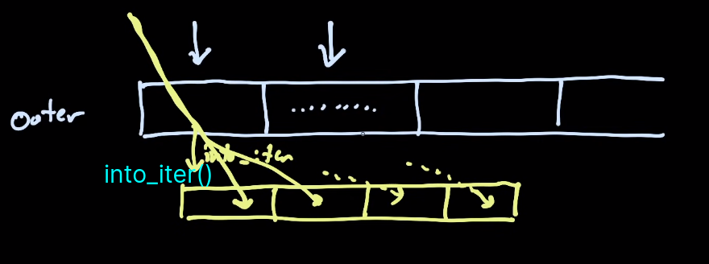

``` rust
  for x in vec!["a","b","c"]/*.into_iter()*/ {
      //	...
  }
```

desuger : 

``` rust
  let iter = vec!["a","b","c"].into_iter() ;
  while let Some(ele) = iter.next() {
      // ... 
  }
```


为何将类型定义作为trait的一个字段? 

```rust
trait Iterator {
    type Item;
    fn next(&mut self) -> Option<Self::Item>; 
    // ... 
}
```

而不写成泛型参数的形式 : 

```rust
trait Iterator<Item>
{
    fn next(&mut selt) -> Option<Item> ;
    // ... 
}
```

因为我们想使对每个类型 (eg `Vec<T>`) 只实现一个Iterator trait.  而不是分别出现: `Iterator<i32>` , `Iterator<u64>`, ... . 而作为泛型参数则在语法上使得能为一个struct实现impl多个 `Iterator<T> trait` . 

( 这里的trait有点像OCaml中的module struct/signature ) 

其根本原因在于迭代器的功能在于按照一定顺序遍历元素. 而这个功能不会因为类型Item的不同而发生变化.   ( 功能逻辑是否会因为具体类型的不同而发生变化 ) 

相反地, 有个不能用第一种形式的例子: 

```rust
trait Service<Request> {
    fn do(&mut self, r: Request) ; 
} 
```

类型request在这里不能作为成员, 而是要作为泛型参数. 

因为不同的Request对应的处理函数`do()`的逻辑不同, 为了能对同一个struct多次分别实现不同的trait, 这里要将其作为泛型参数.  


```rust
let vs = vec![1,2,3,4];

for e in vs {
    // consumes vs, owned e.
}
```
```rust
for e in vs.iter() {
	// borrows vs, v is a reference. 
}
for e in &vs {
	// equivalent to vs.iter().
}

```

 ```rust 
 trait Iterator {
     type Item;
     // ......
     fn flatten(self) -> Flatten<Self> 
     where 
         Self::Item : IntoIterator
     {/*...*/}
 }
 ```



```rust
let vec = vec![vec![1,3,5],vec![2,4,6]] ;
let f = vec.into_iter().flatten().collect::<Vec<u8>>();
assert_eq!(f, &[1,3,5,2,4,6]); 
```

在flatten的声明中要求迭代器中的Item必须实现了`IntoIterator`, 这点结合例子就很容易理解, 在这里每一项是一个vec, 因此必须有能力对每个元素本身进行遍历, 因此自然要求Item实现了某种迭代器trait.


`IntoIterator`是将容器**转换**为迭代器的trait. (而不是通过借用导出一个迭代器: `.iter()`/`.iter_mut()`  ), 其重点是如何实现转换函数: `into_iter(self)`

```rust
trait IntoIterator{
    type Item;
    type IntoIter: Iterator<Item= Self::Item>;
    fn into_iter(self) -> Self::IntoIter ;
}
```

其trait只有三个成员. 

