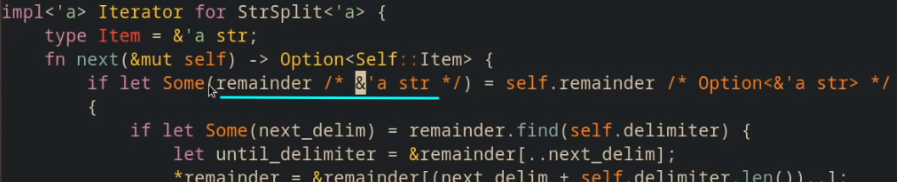
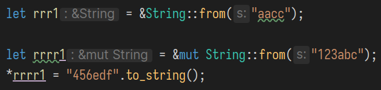
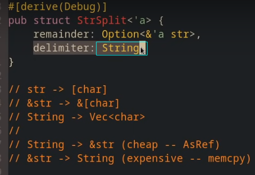
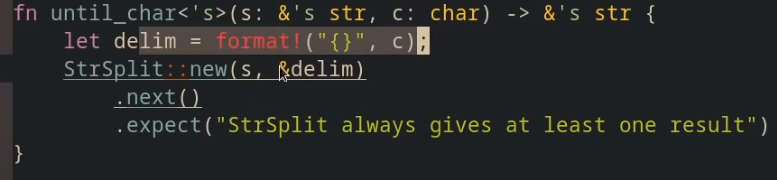
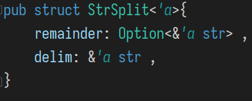
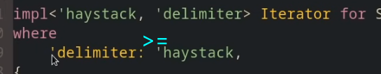
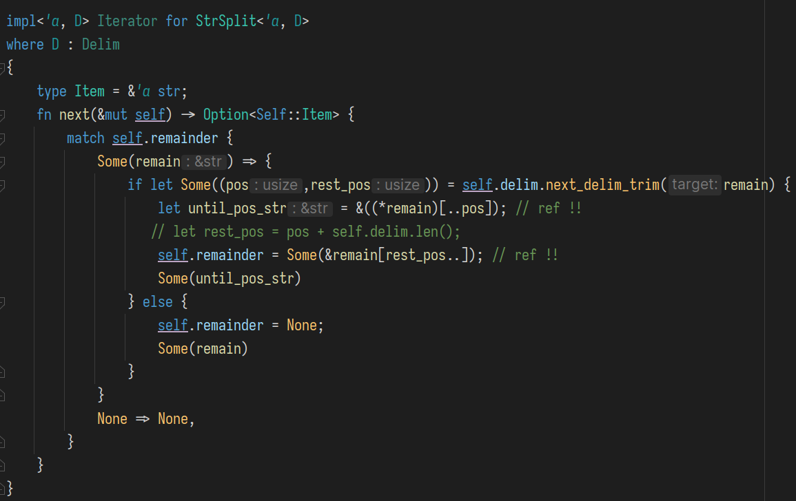

# Rust 生命周期杂记 

实现简单的字符串分隔功能

``` 
cargo new --lib strsplit 
```


在lib.rs中添加: 

```rust
// #![warn(missing_debug_implements,missing_docs,rust_2018_idioms)]

pub struct StrSplit {
    // ...
} 
    
impl StrSplit {
    pub fn new(target: &str, delim: &str) -> Self
    { 
        // .. 
    }
}

impl Iterator for StrSplit  {
    type Item = &str; 
    fn next(&mut self) -> Option<Self::Item> {
        // .. 
    } 
}
    

#[test]
fn it_works(){
    let s = "a b c d e";
    let letters = StrSplit::new(s," ").into_iter().collect::<Vec<&str>>();
    //eprintln!("{:?}", letters);
    assert_eq!(letters, vec!["a","b","c","d","e"]);
}
```


为struct添加两个字段, 一个表示分隔符, 另一个表示剩下的字符串. 

```rust
pub struct StrSplit{
    remainder: &str, 
    delim: &str,
}
```

我们不需要一次性将字符串分隔为字符串序列, 而是当每次调用next()时返回下一个子串即可. 

```rust
pub fn next(&mut self) -> Option<Self::Item> {
    
    if let Some(pos) = self.remainder.find(self.delim) { 
        
        let until_pos = self.remainder[..pos] ; 
        let rest_pos = pos+ self.delim.len();
        self.remainder = self.remainder[(rest_pos)..] ;
        Some(until_pos)
        
    } else if self.remainder.is_empty() {
        None 
    } else {
		let final = self.remainder;
		self.remainder = ""; 
		Some(final)
	}
}
```

上面代码的整体逻辑已经完成了, 但却无法通过编译, 因为缺乏生命周期声明. 

`'_`表示让编译器自行推断生命周期. 

```rust 
fn foo<'a,'b>(x:&'a str, y :&'b str) -> &'a str {
    
}
// 等价于: 

fn foo (x:&str, y :&'_ str) -> &'_ str {
    // 返回类型上的 '_ 表示让编译器自行推断生命周期. 
    // 而参数的类型中的 '_ 表示此引用的生命周期是任意的.(不关心此生命周期) 
}
```

`'a` 表示一种生命周期, struct中的'a表示,  struct StrSplit 具有生命周期 'a , 若其两个(引用)字段的声明周期也是'a 

impl中的new()要使用上面声明的生命周期参数, 表示当引用参数的声明周期均为 `'a` 时 , 则其创建的StrSplit也具有生命周期`'a `


 

添加生命周期后的代码: 

```rust
pub struct StrSplit<'a>{
    remainder: &'a str,
    delim: &'a str ,
} 

impl<'a> StrSplit<'a> {
    pub fn new(target:&'a str, delim:&'a str) -> Self {
        StrSplit {
            remainder: target,
            delim,
        }
    }
}

impl<'a> Iterator for StrSplit<'a> {
    type Item = &'a str ;
    fn next(&mut self) -> Option<Self::Item> {

        if let Some(pos) = self.remainder.find(self.delim) { 
            
            let until_pos = &self.remainder[..pos]; // ref !! 否则返回的是 str 类型 
            let rest_pos =  pos + self.delim.len();
            self.remainder = &self.remainder[rest_pos..]; // ref !!
            Some(until_pos)
        } else if self.remainder.is_empty() {
            None // bug  <<---------------------+
        } else {							               // |
            let final_part = self.remainder; // |
            self.remainder = "" ; // -----------+
            Some(final_part)
        }

    }
}
```

但这段代码的实现是有问题的. 当我们将remainder消耗完后, 将其置为空串`""`, 但存在一种边界情况, 即分隔符在字符串的末尾: `"hello world#"`. 此时的切分结果应该是 `["hello world", ""]` .但上面的代码无法区分最后剩下一个空串还是已经将remainder消耗完这两种情况. 因此我们要修改struct中的字段类型, 使得它能表达出"空"的含义, 从而不和空串发生冲突.  

使用类型 `Option<>`, 其中的`None` 能表达出空的语义 : 

```rust
pub struct StrSplit<'a>{
    remainder: Option<&'a str>,// 用None来区分remainder被耗尽后的None, 
    delim: &'a str ,            // OR 字符串恰好剩下空串Some("") 
}

impl<'a> StrSplit<'a> {
    pub fn new(target:&'a str, delim:&'a str) -> Self {
        StrSplit {
            remainder: Some(target) ,
            delim,
        }
    }

}

impl<'a> Iterator for StrSplit<'a> {
    type Item = &'a str ;
    fn next(&mut self) -> Option<Self::Item> {
        match self.remainder
        {   // remain : &str 
            Some(remain) =>
                if let Some(pos) = remain.find(self.delim)
                {
                    let until_pos = &remain[..pos]; // ref !!
                    let rest_pos = pos + self.delim.len();
                    self.remainder = Some(&remain[rest_pos..]) ; // ref !!
                    Some(until_pos)
                }
                else
                {
                    self.remainder = None ;
                    Some(remain)
                },
            None => None
        }
    }
}
```


## 模式中的 `ref mut`

等号右侧的类型是 `Option<&'a str>`

若对remainder不加任何修饰, 则其脱去Some后的类型是 `&'a str'`



因为在此处self是一个**可变**借用( 的解引用 ) , 因此可以让remainder作为一个可变借用 (而不仅仅是一个不可变借用) , 因此在其前面加上修饰 `ref mut`, 使其类型为 `&mut &'a str'` , 即 `&mut remainder的类型`,  对remainder的可变借用. 


在这里为什么将 可变引用`&mut`  / 不可变引用`&` , 写成 `ref mut`和 `ref` 呢 ? 

因为前者在模式匹配里是作为"模式串"的一部分, 而不修饰变量.  注意下面产生的不同类型: 


下面这两类写法是等价的: 





##  `Option<T>`和`?`

因为`next()`的返回类型为 `Option<>` , 并且其实现中存在模式: 

```rust
if let Some(...) = option_expr {
    // code...
    return Some(..)
} else {
    None 
}

/** OR */ 

match option_expr {
    Some(...) =>{ 
        // code...
        return Some(..)
    },
    None => None
}
```

这种模式可以用`?`进行简化为 : 

```rust
let v = option_expr?;

// code... 
return Some(..);
```

问号`?`的作用是: 

- 若此`Option`类型的值为 `Some(x)` , 则将`x`赋值给`v` ; 
- 若值为`None` , 则会改变控制流, 提前`return None;` 


## `Option.as_mut()`


`as_mut()` **:**  `&mut Option<T>` $\rightarrow$ `Option<&mut T>` 

as_mut 是一种可变借用Some() 中的值的快捷方法. 


## `&str` 和 `String`


`str`表示一个字符序列, 其长度未知. 

而`&str`是一个 **fat pointer** : 它不仅包含了`str`的起始地址, 还记录了其长度. 

`String`具有一个在heap上分配内存的`vec<u8>` , 很容易得到其字符序列的起始地址, 以及长度, 因此很容易将其转换为 `&str`. 但反过来的转换就有比较大的开销, 因为`&str`所指向的字符序列不一定存储在heap中, 因此需要将其逐个拷贝到heap中. 




## struct中的多个生命周期

`until_char(&'x str, char)  -> &'x str`



在这个函数的实现中, new()的调用是出错的, 原因在于new()中的两个借用的生命周期被期望是一样的, 而在这个例子中的两个参数, s的生命周期显然要>= `&delim` , delim会在退出词法作用域后被drop. new()为了遵守两个作为输入的借用的生命周期是一致的, 会取生命周期较短的那个作为返回值(struct)的生命周期, 进而作为next()的返回值(Option<&'a str>) 的生命周期. 最后将Option中的借用作为整个函数的返回值. 

换句话说, 返回值的生命周期和delim这个局部变量相同, 即返回了一个对已被drop对象的借用 ! 这自然是不被允许的. 

如何解决这个问题? 

我们需要仔细考虑返回的借用的源头, next()返回值的生命周期来源于struct的生命周期, 而struct的来源于它的两个借用类型的字段的声明周期: 都是 'a . 



但根据next的语义, 其返回的被分隔字符串的一部分, 其实仅仅需要将其生命周期和`remainder`关联起来, 而不需要和delim的生命周期产生关系.因此我们要将隐含的假设:  **remainder和delim的生命周期是相同的 ** 去掉.


```rust
pub struct  <'a,'b>{
    remainder: Option<&'a str> , // 用None来区分 remainder被耗尽后的None, 以及字符串恰好剩下空串Some("")
    delim: &'b str ,
}

impl<'a,'b> StrSplit<'a,'b> {
    pub fn new(target:&'a str, delim:&'b str) -> Self {
        StrSplit {
            remainder: Some(target) ,
            delim,
        }
    }

}

impl<'a,'b> Iterator for StrSplit<'a,'b> {
    type Item = &'a str ;
    fn next(&mut self) -> Option<Self::Item> {
        match  self.remainder
        {
            Some(   remain) =>
                if let Some(pos) = remain.find(self.delim)
                {
                    let until_pos = &((*remain)[..pos]); // ref !!
                    let rest_pos = pos + self.delim.len();
                    self.remainder = Some(&remain[rest_pos..]) ; // ref !!
                    Some(until_pos)
                }
                else
                {

                    self.remainder = None ;
                    Some(remain)
                },
            None => None
        }
    }
}
```

```rust 
fn until_char(s:&str, ch: char) -> &str {
    let delim = format!("{}",ch); // format()中在heap中创建了新字符串. 
    StrSplit::new(s,&delim).next().expect("err")
}

#[test]
fn test_until_char(){
    assert_eq!(until_char("hello",'o'),"hell");
}
```


### 生命周期间的关系 

描述多个生命周期之间的关系,  用 `:`  , 表示`>=`




### 省略无用的生命周期注解:


## 对`Option<>`类型应用 `map()`

可以对Option类型直接使用map来操作其中包裹的值. 

```rust
  println!( "{:?}" , Some(0).map(|i| {
      if i == 0 { 100 }
      else { i }
   }));  // Some(100)
///////////////////////////////////////
   println!( "{:?}" , None.map(|i| {
      if i == 0 { 100 }
      else { i }
   })); // None 
```


`find(匿名函数)`: 查找容器/序列中的元素

 


## 计算字符长度`len_utf8()`

```rust
 		let s = "你好世界" ;

    for (i,c) in s.char_indices() {
       eprintln!("{}->{}:{}",i , c ,c.len_utf8());
    }
```

```rust
0->你:3
3->好:3
6->世:3
9->界:3 
```

 

## 使用被trait约束的泛型做进一步抽象

上面的 `until_char()` 方法是为了处理分隔符为字符类型时的情况, 因为我们定义的`struct StrSplit`中将分隔符类型写死为 `&str`. 

因此有一个能消除`until_char()`的方法,就是将分隔符类型变为泛型. 并为这种泛型添加trait约束, 这种trait的功能要和先前`&str` 类型的分隔符被使用的功能是一样的. 


对struct定义的修改是很容易的. 但`Iterator`的实现中就要使用`delim`特质了! 

那么限制泛型`D`的`trait Delim`应该实现为什么呢? 

首先最直接的思路就是将报错标红的两处所用到的功能添加到trait中: 

一个是转换为字符串, 另一个是返回分隔符的长度. 

但这种方式就和之前的`until_char`的实现类似, 一定有一步要将类似char这种分隔符通过`format()`创建一个新的字符串并返回, 对其主要目标: "分隔字符串为序列" , 来说不是必须的一步. 

因此我们看标红处所做计算的目的, 一个是为了得到`pos`, 另一处是为了 `until_pos`, 分别是分隔符所在的开始位置, 和分隔符后的首个字符位置. 因此我们的trait其实只要提供这两个位置就行了.   


`next_delim_trim()`:  "下一个分隔符所在范围" 

因为存在目标串中已经不包含分隔符的情况, 因此返回值要用 `Option<>` 包裹起来 




简单测试一下: 

```rust
  assert_eq!(StrSplit::new("helloo", "oo").next().expect("err"), "hell");
  assert_eq!(StrSplit::new("hello", 'o').next().expect("err"), "hell");
```


---

>为何不能直接定义 `str`类型的变量? 
>
>因为这种变量拥有数据的所有权, 因此会在退出词法作用域时drop其拥有的数据, 而这种str类型的数据存放在只读的数据段, 不能被drop. 
