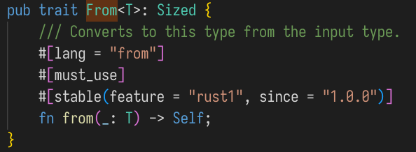

[RUST CLI](./rust-cli.org)

# Unsafe

将值"偷"出来, 用垃圾值给原位置占位

``` rust
let value = mem::replace(&mut node.value, V::default());
// value 是我们想要取出来(拿走所有权)的值
```

申请并泄漏内存(不会自动drop)

``` rust
let ptr : NonNull<_> = Box::leak(Box::new(...)).into();
```

? mem::forget()

回收Box::leak()的内存

``` rust
let value : Box<T> = Box::from_raw(NonNull::as_ptr())
drop(value)
```

# cargo

创建一个rust项目:

``` bash
cargo new <project-name> 
```

同时会自动初始化 git 仓库 (`git status`) 为项目添加依赖: `Cargo.toml`
可以到 `crates.io` 上查询所需的包名

    [dependencies]
    rand = "0.8.4"

## 对代码进行格式化cargo fmt

## cargo test

## 编译链接 cargo build

可能会卡在: `Updating crates.io index` 删除文件:

``` bash
rm -rf ~/.cargo/registry/*
```

## 对代码进行检查: cargo clippy

## 用cargo安装二进制包

``` bash
cargo install cargo-expand 
```

这个命令可能会需要nightly的toolchain

``` bash
rustup toolchain list 
```

``` bash
rustup toolchain install xxxxx 
```

## 以release模式进行编译

    --release / -r  

# 常用的宏

line!() column!() file!()

# 数据类型

rust是一门静态类型的语言,
这意味着rust编译器要在编译期就知道所有变量的类型.
rust编译器会尝试推断类型, 但有时候仍需要手动标注:

``` rust
let guess : u32 = "42".parse().expect("not a num"); 
```

`parse` 会尝试将字符串转换为数字类型,
但在这里没有足够的信息来推断具体是哪一种整数类型. 也可以写成:

``` rust
parse::<u32>()
```

## 标量Scalar类型

### 数字类型

1.  整数

    从表示方式上能分成两类, `uX` , `iX` X表示数据的宽度,
    和机器无关的宽度为: 8 , 16 ,32 ,64, 128 和机器相关的有: `usize` ,
    `isize` 在32位平台则为u32, 在64位平台上则为 u64

    数字的字面量有以下特殊之处:

    - `_` 可以作为分隔符: `1_000`

    - 可以添加类型后缀: `233_u8`, `233u8`

    整数字面量的默认类型为 `i32` ; `isize` / `usize`
    的主要作用是作为容器的索引.

2.  浮点数

    默认的浮点数字面量的类型为 `f64` 不要在浮点数上进行相等性测试! (
    `==` / `!=` ) 即便用 `f32`
    类型的浮点数进行比较能得到符合算术上的正确结果也只是凑巧,
    在任何时候都不能用等号/不等进行比较.
    而是要用二者之差来和指定的误差范围进行比较.

    ``` rust
    assert!( (0.1_f64+0.2 -0.3).abs() < 0.0001 );
    ```

3.  `NaN`

    NaN == "not a number" 是某些算术运算的返回结果, 表示结果是无效值.

    可以用 `is_nan()` 来检查结果.

    ``` rust
    let res = (-23.0_f32).sqrt();
    if res.is_nan() {
        //.. 
    }
    ```

4.  Range

    range有两类, 一种是左闭右开 `Range` , 另一种是左闭右闭
    `RangeInclusive` .

    ``` rust
    use std::ops::{Range, RangeInclusive};
    fn main() {
        assert_eq!((1..5), Range{ start: 1, end: 5 });
        assert_eq!((1..=5), RangeInclusive::new(1, 5));
    }
    ```

### 字符类型

rust中的字符是unicode编码的,每个字符占 `4个字节`

可用 `size_of_val()` 来验证:

``` rust
use std::mem::size_of_val;

let c1 = 'a'; // 1字节编码 
assert_eq!(size_of_val(&c1),4); 

let c2 = '中'; // 3字节编码
assert_eq!(size_of_val(&c2),4); 
```

### 复合类型

rust的基本复合类型有两种: tuple和array

1.  tuple

    tuple是固定大小的. 一但被声明, 其变量的大小就不能再变化.

    ``` rust
    let tup : (f32,u8) = (2.33, 4); 
    ```

    用模式匹配解构tuple值:

    ``` rust
    let (x,y) = tup;
    println!("{}",x);
    ```

    ``` rust
    let (mut x, y) = (1, 2);
    x += 2;
    ```

    访问Tuple中的元素:

    ``` rust
    let fst = tup.0;
    let snd = tup.1;
    ```

    没有任何值的tuple有个特殊的称呼: Unit 其类型和值都写成 `()`
    表达式在不返回值的情况下会隐含地返回unit值

    Unit值的大小为 `0` !!

    ``` rust
    use std::mem::size_of_val;

    fn main() {
        let unit: () = ();
        assert!(size_of_val(&unit) == 0);
    }
    ```

2.  array

    array中的元素需要有相同的类型. array类型的长度在声明后被固定下来,
    无法再变化. array类型的值在stack上分配(而不是heap)
    array类型在已知元素个数时首选, 否则应考虑用vector.

    ``` rust
    let months = ["January", "February", "March", "April", "May", "June", "July",
                  "August", "September", "October", "November", "December"];
    ```

    array的类型标注: `[定长类型;Num]`

    ``` rust
    let a : [i32;3] = [1,2,3] ;
    ```

    创建N个相同的元素构成的数组:

    ``` rust
    let a = [1;5]; //i.e. [1,1,1,1,1] 
    ```

    访问数组的元素:

    ``` rust
    let fst = a[0] ;
    ```

    当索引越界时, 会导致运行时错误(panic)

## 数组

\[T;n\] \[val;N\] .get(N) -\> Option\<T\>

## 切片类型 Slice

slice是一种引用, 因此它没有数据的所有权.

slice引用一个集合中的连续元素序列.

常见的string字面量类型 `&str` 就是一种切片类型.

数组的切片类型: `[T; 3]` 以及它的各种引用都没有实现 Index 索引,
在直觉中，数组都可以通过索引访问，实际上只有数组切片 `[T]` 才可以!

``` rust
let arr: [i32;3] = [1,2,3];

let slice : &[i32] = &arr[1..];

assert_eq!(slice ,&[2,3]);
```

使用切片类型能防止原集合在切片未使用完前被修改.

``` rust

fn first_word(s : &String) -> &str {
    let chs  = s.chars();
    for (i,ch) in chs.enumerate() {
    if ch == ' ' {
        return &s[..i];
    }
    }
    &s[..]  
}

#[test]
fn test1(){
    let source = String::from("hello fuck word");
    let f = first_word(&source);
    //ERROR: source.clear()
    eprintln!("first_word ==> {:?}",f) ;
    eprintln!("{}", source);
}
```

### 作为参数的切片类型

传入集合类型,还是其切片类型? 为了通用性, 入参的类型最好是slice类型.

``` rust
fn first_word(s:&str) -> &str{
    //..
}
fn main(){
    let source = "hello".into_string();
    let a =first_word(&source[..]);
    let b =first_word("hello world");
    let c =first_word(&source);
    let d = first_word(source.as_str());
}

```

## 用struct组织相关联的数据

struct是一种用来将多个相关联的值分别命名,并将它们打包到一起的自定义类型.

### 定义并实例化struct

struct类型 is similar to tuple type. They both hold multiple related
values. like tuples, struct的字段可以是不同类型的. unlike tuples,
在struct中可以为每个字段命名.

1.  定义struct:

    ``` rust
    // struct名字为驼峰命名
    struct User { 
        active: bool,
        username: String,
        email: String,
        signin_count: u64, // 最后一个字段结尾有逗号
    }
    ```

2.  创建一个struct实例:

    创建时对字段的初始化顺序是没有要求的,不必和定义的顺序是一致的.

    ``` rust
    #[test]
    fn test_struct_user() {
        let usr = User {
        username: String::from("sun"),
        active: true,
        email: String::from("saltedf@qq.com"),
        signin_count: 100_u64 ,
        };
        eprintln!(">> {:#?}",usr); 
    }
    ```

3.  用和字段同名的变量来简化struct的创建

    ``` rust
    fn new_usr(username:String, email:String)-> User {
        User{
            username,
            email,
            active:false,
            signin_count: 0,
        }
    }

    #[test]
    fn test_field_init_shorthand() {
        let mut usr = new_usr(String::from("sam"),String:from("123@qq.com"));

        eprintln!("{:#?}",usr);
    }
    ```

4.  基于其它struct值来实例化struct

    通常发生于
    新创建的struct实例仅仅和已有的struct值的少数几个字段不同时. 可以用
    **struct更新语法** 来简化.

    ``` rust
    #[test]
    fn test_struct_update_syntax(){

        let usr = new_usr(String::from("amy"), String::from("amy@qq.com"));
        eprintln!("{:#?}",usr);
        let usr1 = User {
        active: true,
        signin_count: 1,
        ..usr // 此处不能加逗号! 
        };
        //此处 usr 的所有权已经转移给 usr1, 因此已经失效. 
        eprintln!("{:#?}",usr1);
    }
    ```

    这种用部分struct的字段创建新值,也是会导致所有权的转移的.

    若复用的字段实现了Copy trait, 那么发生的是字段的复制,
    因此原来的struct值还是有效的.

    若复用的字段涉及了没实现 `Copy` trait的字段,
    那么该字段上的所有权会被转移,
    整个struct变量失效.但那些没被复用的字段/被复用但实现了 `Copy`
    的字段仍然可以被访问.

5.  访问struct的字段

    用 `s.field` 来指定字段.

    ``` rust
      #[test]
    fn test_struct_field() {
        let mut usr = User {
            username: String::from("sun"),
            email : String::from("saltedf@qq.com"),
            active: false,
            signin_count: 100,
        };
        usr.active = true ;
        eprintln!(">>{:?} has signed in {} times",usr.username, usr.signin_count ) ;
    }
      //>>"sun" has signed in 100 times
    ```

### tuple struct

tuple struct和tuple类似, 字段是不进行命名的.
这种东西常常是为了给某种tuple一个名字,来和寻常tuple进行区分.

``` rust
struct Point(f32,f32,f32) ;

fn main(){
    let p = Point(0.0, 1.0, 2.0);
    println!("{:?}", p.0 );
}
```

### unit-like struct

即是: 没有任何字段的struct.

在对 \<一些无数据的类型\> 实现trait时有用.

``` rust
struct AlwaysEqual;

fn main() {
    let subject = AlwaysEqual; 

}
```

### struct的方法

和函数的区别:

- 在struct中定义
- 首个参数一定是某种 `self`

1.  定义方法

    - `Self` 自动就是当前 Struct类型 的别名

    - 读取对象method: `&self` 是 `self: &Self` 的简写.

    - 修改对象method: `&mut self` 是 `self: &mut Self` 的简写.

    - 消耗对象method: `self` 是 `self:Self` 的简写.
      这种参数类型是比较少用的. 用在当方法将self对象转换为另一种形式后,
      并且想让原对象(原来的形式)无法再被访问.

    ``` rust
    #[derive(Debug)]
    struct Rectangle{
        width: u32,
        height : u32, 
    }
    impl Rectangle {
        /* self: &Self */
        fn area(&self) -> u32 {
        self.width * self.height 
        }

        fn can_hold(&self,other:&Self) -> bool{
        self.width >= other.width &&  self.height >= other.height
        }
    }
    #[test]
    fn test_method() {
        let r = Rectangle {
        width : 4,
        height : 5,
        };

        assert_eq!(r.area(),20) ;

        assert_eq!(r.can_hold(&r),true) ;
    }
    ```

2.  关联函数

    在impl块中定义的普通函数(无self参数)

    通过 `StructName::func` 引用.无需struct实例(静态方法)

    ``` rust
    impl Rectangle {

        //....

        fn make_square(size: u32) -> Self {
        Rectangle {
            width: size,
            height: size,
        }
        }
    }
    ```

    ``` rust
    let sq = Rectangle::make_square(12);
    assert_eq!(sq.area(),144) ;
    ```

3.  多个 `impl` 块

    每个struct可以有多个impl块, 这个语法主要用在涉及泛型/trait时,
    为满足不同条件的struct额外定义特殊的方法.

### 使用struct的示例

## Enum: rust中的变体Variant

enum 允许定义一类值的所有可能形式.同时用来承载数据以及标明对应值的种类

例如IP地址, IP地址有两种版本 ipv4和ipv6.

``` rust
#[derive(Debug)]
enum IpAddrKind { // 名字为驼峰式
    V4(u8,u8,u8,u8),
    V6(String),
}

let home = IpAddrKind::V4(127,0,0,1); 
let loopback = IpAddrKind::V6(String::from("::1"));
eprintln!("{:#?}",home);
eprintln!("{:#?}",loopback); 
```

标准库中提供了IP地址的实现:

``` rust
struct Ipv4Addr {
    // --snip--
}

struct Ipv6Addr {
    // --snip--
}

enum IpAddr {
    V4(Ipv4Addr),
    V6(Ipv6Addr),
}
```

在enum中使用struct类型:

``` rust
enum Message {
    Quit,  // unit-like struct
    Move {x:i32,y: i32}, // normal struct 
    Write (String), // tuple struct
    ChangeColor(i32,i32,i32) ,// tuple struct 
}
```

为Enum实现方法:

``` rust
impl Message {
     fn call_on(&self)  {
         println!(">> {:?}",self) ;
     }
 }

 let msg = Message::Move{x:12,y:34};
 msg.call_on();
```

### 标准库中的Enum: Option\<T\>

``` rust
enum Option<T> {
    Some(T),
    None,
}
```

这个类型表达了一种很常用的想法, 一个值中要么存放着某些东西(Some),
要么为空(None). 而不像在 `C` 中要用某个特殊值来表达None的含义(eg: `-1` ,
`0` , `""`, `NULL`, …) ,这在很多时候会导致冲突.

而Option作为一种类型会强迫代码必须注意值为None的可能性,
而不是用一个flag来手动判断(很容易忘记). Option\<T\> 和 T不是同一类型,
为了将Option\<T\> 转换为T, 要对Some/None的情况进行区分.

对enumn中的不同变体分别进行处理的常用方法是使用 match

``` rust
fn use_match(op: Option<i32>) -> i32 {
    match op {
    Some(val) => val  ,
    None => -1 ,
    }
}
```

### `if let` : 只处理一种模式的语法糖

``` rust
let val = Some(32);

if let Some(v) = val { // Some(v) 
    println!("{}", v);
} else { // None
    println!("nothing");
}
```

# 函数

发散函数(diverging), 其返回类型为 `!` , 可以充当任何类型的值.

实现发散函数的几种方式:

``` rust
fn never_return_fn() -> ! {
    // todo!() 
    // unimplemented!() 
    // loop {  } 
    panic!("never return!")
}
```

# 流程控制

## for

## loop

loop类似于 while(true)

但有几个不同之处

- break能携带返回值, 进而使得loop表达式带有值.

``` rust
let res = loop {
  // ..
    break 100 ;
}
```

- 用标签来区分嵌套的loop

``` rust
'outer:loop {

    loop {

    if .. {
        break; // 跳出内层循环
    }

    if ... {
        break 'outer; //跳出外层循环 
    }
    }

}
```

# 所有权 ownership

所有权是一些关于rust程序如何管理内存的规则.

可使用内存区域分为堆和栈. 栈中的数据必须在编译时有已知且固定的大小.
堆中的内存通过分配器进行管理, 每当向分配器申请内存时,
分配器会找到一块内存, 并将其地址返回.这个地址是大小固定的指针类型,
因此它可被存储在栈上.

入栈比在堆上分配数据要快, 访问堆上数据同样比访问栈上数据要慢.

## 所有权规则

- rust中的每个值都有其owner
- 每个值同时只能有一个owner
- 当已经离开owner的作用域后, 其对应的值会被drop

## 变量的作用域

作用域指的是一个名字/绑定 为有效的范围.

``` rust
{ // s is not valid

    let mut s = String::from("str"); // 在堆中分配内存 
    // do something with s 
} // s is not valid, 调用drop() 并自动释放内存 
```

下面这段代码会出错, 原因是最下面那行使用了已被move的变量. 但是,
若s是一个数字/&str, 这段代码就是正常的.
原因在于后者不发生移动move.s的所有的资源被移走给了s1.
而当数据类型为定长的基本类型时发生的是拷贝.因此s仍然拥有资源.

什么是是移动? 被移动对象会将其中的资源地址复制给目标对象,
然后将自己的地址设为无效值.

那这里为什么不令其拷贝数据?
原因在于很多对象持有堆上资源的方式是记录其指针.
而若将其持有的指针拷贝到其它对象中(浅拷贝),
因为rust的作用域规则会导致尝试对同一地址drop多次.这导致了double free.
而若进行的是深拷贝, 即递归地将堆上的数据也相应地拷贝一份,
这种方式的开销相对太大, 不适合经常使用.

因此对于这种在堆上的对象, 对其进行赋值的最好方案是将其移动.
这就是引入所有权这个概念的原因.

``` rust
{
    let s = String::from("hello");
    let s1 = s ;
    println!("{:?}",s); // <--- error!! 
}
```

而当我们知道自己在做什么时, 若不想让s被move而失效, 则可以使用clone()

``` rust
{
    let s = String::from("hello");
    let s1 = s.clone()
    println!("{:?}",s); // <--- Ok!
}
```

而对于那些定长的基本类型,
似乎不用显式调用clone()就能完成拷贝.这是如何做到的呢?

完全在栈上的分配的对象(无指针成员) 是没有深浅拷贝之分的,
因此不用担心double free的问题.因此其默认就是拷贝.

rust中实现了 `Copy` 的类型的默认行为会从move改为clone(),
那些定长的基本类型都实现了此trait.

并非所有类型都能实现 `Copy`, 那些类型/类型中的组成部分若实现过 `Drop`
trait则不能实现 Copy

## 所有权和函数

参数传递中的所有权规则类似于变量赋值. 可能发生move/copy

## 返回值和作用域

返回值也会导致所有权的转移. 当变量的所有权发生转移,
则即便退出词法作用域也不会对资源进行drop

``` rust
fn gives_ownership() -> String {
    let sth = String::from("hello");
    sth // 此处sth不再拥有资源. 
}
```

## 引用类型和借用

有时候我们不需要变更所有权. 比如说传入函数,然后仅仅读/修改它.

引用类型就和指针类似, 它是一个地址,
我们跟从这个地址来访问其数据,且这些数据是被其它变量拥有的.
但和指针不同的是, 引用在其声明周期内被确保指向一个有效的值.

引用不实际拥有资源, 因此当离开作用域后, 引用所指向的数据不会被调用drop.

``` rust

fn print_len(s:&String ) {
    print!("{:?}", s.len() );
}

fn main(){
    let s = String::from("hello");

    print_len(&s); // <-- immutable ref 
}

```

这种引用是不可变的, 也就是说无法对所指向的数据进行修改.

### 可变引用

在引用符号后加上 `mut` 就能修改其所指向的数据,
但这个前提是该数据的owner本身是有权限修改数据的(即被 `mut` 修饰)

``` rust
fn change_str(s: &mut String) {
    s.push_str(s);
}

fn main() {
    let mut s = String::from("mutable");
    change_str(&mut s);
}
```

但可变引用(的定义)存在一个巨大的约束:

**可变引用的使用范围:** 从可变引用的定义开始,
到最后一次使用(哪怕只是读)该可变引用的位置.

可变引用的使用范围不能和对同一资源的其它引用的使用范围有交集.

因此可变引用有一个别名: 独占引用. 在对独占引用的使用期间,
中间不能用其它的(对同一资源的)引用对变量进行读写,
或是对同一owner定义引用变量.

``` rust
  fn main() {
      let mut source = String::from("hello");
      let mref = &mut source;
//ERROR: let imref = &source; // 位于mref的使用范围! 
      print!("{:?}", mref);
  }
```

对可变引用施加的严格限制是为了防止"数据竞争": (类似并发场景下的竞态条件)

- 至少有两个指针在 **同一作用域** 中访问同一数据, 且
- 至少一个指针用来修改数据, 且
- 不存在同步数据访问的机制.

用大括号创建一个新的作用域可以规避掉这一限制:

``` rust
fn main() {
    let mut s = String::from("hello");
    {
        let r1 = &mut s;
    } // r1 goes out of scope here, so we can make a new reference with no problems.
    let r2 = &mut s;
}
```

## 作为返回值的引用类型

当引用类型作为返回值时, 有一个明显的问题就是 dangling ref, 即:
数据真正的owner变量被drop时,该数据所在内存被释放,
因此对该数据的引用都将会失效.

这个问题将引入 **生命周期** 进行解决.

# 迭代器

``` rust
1..10; // ==>  1~9
1..=10; // ==> 1~10
```

用这种方式若元素没实现Copy,则集合的所有权在for之后被move
若集合元素实现了Copy ,则原集合所有权不动.

``` rust
for x in vec!["a","b","c"]/*.into_iter()*/ {
    //    ...
}
```

desuger:

``` rust
let iter = vec!["a","b","c"].into_iter() ;
while let Some(ele) = iter.next() {
    // ... 
}
```

``` rust
let arr = [12,43,5];

for e in arr.iter() {

}
// 等价: 
for e in &arr{

}
```

``` rust
let mut  arr = [12,43,5];

for e in arr.iter_mut() {

}
// 等价: 
for e in &mut arr{

}
```

## `.enumerate()` 为元素附加上index

``` rust
let a = [3,4,5];
for (ind, val) in  a.iter().enumerate()  {
    println!("{}-> {}",ind, val );
}
```

``` rust
0-> 3
1-> 4
2-> 5
```

# Vec

## `with_capacity(usize)`

以指定容量创建一个空的Vec. 其len为0. (当len超过此初始容量时会触发
reallocate)

## v.extend(迭代器)

在vec后追加迭代器中元素.

``` rust
let vec:Vec<Vec<K,V>> = with_capacity(10);
vec.extend((0..size).map(|_| Vec::new() ));
```

## drain(..)

`vec.drain(Range)`

- 创建指定范围中的vec的迭代器.

- 其内部使用了对源vec的可变借用.

- 当退出返回值的词法作用域后, 将drop掉源vec中的指定部分.

``` rust
let mut v:Vec<i32> = vec![1,2,3,4] ;

{
    let iter:Drain<i32> =  v.drain(1..); // mutable borrow 
}
println!("{:?}", v); // immutable borrow
```

(典型用法是用for遍历此迭代器. 当for结束后对应部分也随之被销毁 )

# HashMap

key必须实现Hash trait

## 默认的Hash函数 DefaultHasher

用Hasher计算key(实现Hash trait) 的hash value :

``` rust
let mut hasher = DefaultHasher::new() ;
*key.hash(&mut hasher);
hasher.finish(); // -> u64  
```

# 泛型

显式指明类型参数: 用 `func::<T>(...)`

``` rust
struct A;          // 具体的类型 `A`.
struct S(A);       // 具体的类型 `S`.
struct SGen<T>(T); // 泛型 `SGen`.

fn reg_fn(_s: S) {}

fn gen_spec_t(_s: SGen<A>) {}

fn gen_spec_i32(_s: SGen<i32>) {}

fn generic<T>(_s: SGen<T>) {}

fn main() {
    // 使用非泛型函数
    reg_fn(S(A));          // 具体的类型
    gen_spec_t(SGen::<A>(A));   // 隐式地指定类型参数  `A`.
    gen_spec_i32(SGen(0)); // 隐式地指定类型参数`i32`.

    // 显式地指定类型参数 `char`
    generic::<char>(SGen('a'));

    // 隐式地指定类型参数 `char`.
    generic(SGen('a'));
}
```

## 带约束的泛型

任意类型的两个值的 **加法** :

要求类型T必须实现过用于加法的 Trait : `Add<Output=T>`

``` rust
fn sum<T>(a:T,b:T)  ->  T 
where T : std::ops::Add<Output = T>, 
{
    a + b
}

```

OR:

``` rust
fn sum<T: std::ops::Add<Output= T>> (a : T,b:T) -> T {
    a + b 
}
```

实现任意类型的两个值的比较: 要求类型T实现了 `std::cmp::PartialOrd` , 即:
偏序关系, 这样才能适用 `>` / `<` 号.

``` rust

```

## 以常量作为泛型参数

``` rust
fn print_array<T, const N :usize> (arr: [T;N])
where T : std::fmt::Debug,
{
    println!("{:?}", arr);
}

fn main() {
    let arr = [1, 2, 3];
    print_array(arr);

    let arr = ["hello", "world"];
    print_array(arr);
}

```

## 常量表达式

尚未进入稳定版本.
可使泛型中填入能带有泛型的常量表达式(编译期能计算出即可)

`{ core::mem::size_of::<T>() < 768 }`
就是一个bool类型的常量表达式.只有当它为true时, Assert\<\>才会实现
`IsTrue` trait, 而函数 `check_size<T>` 只能在此时才被定义.

``` rust
#![allow(incomplete_features)]
#![feature(generic_const_exprs)]

fn check_size<T>(val: T)
where
    Assert<{ core::mem::size_of::<T>() < 768 }>: IsTrue,
{
    //...
}

// 修复 main 函数中的错误
fn main() {
    check_size([0u8; 767]); 
    check_size([0i32; 191]);
    check_size(["hello你好";47]); // size of &str ? 16 
    check_size([();31].map(|_| "hello你好".to_string()));  // size of String? 24
    check_size(['中';191]); // size of char ? 4
}


pub enum Assert<const CHECK: bool> {}

pub trait IsTrue {}

impl IsTrue for Assert<true> {}

```

`trait` 中的类型 VS 泛型

# trait

## 特征对象

常用于返回 类型不同但实现了相同trait

``` rust

trait Bird {
    fn quack(&self) -> String;
}

struct Duck;
impl Duck {
    fn swim(&self) {
        println!("Look, the duck is swimming")
    }
}

struct Swan;
impl Swan {
    fn fly(&self) {
        println!("Look, the duck.. oh sorry, the swan is flying")
    }
}

impl Bird for Duck {
    fn quack(&self) -> String{
        "duck duck".to_string()
    }
}

impl Bird for Swan {
    fn quack(&self) -> String{
        "swan swan".to_string()
    }
}

fn main() {
    // 填空
    let duck = Duck;
    duck.swim();

    let bird = hatch_a_bird(&duck);
    // 变成鸟儿后，它忘记了如何游，因此以下代码会报错
    // bird.swim();
    // 但它依然可以叫唤
    assert_eq!(bird.quack(), "duck duck");

    let swan = Swan;
    swan.fly();

    let bird = hatch_a_bird(&swan);
    // 这只鸟儿忘了如何飞翔，因此以下代码会报错
     // bird.fly();
    // 但它也可以叫唤
    assert_eq!(bird.quack(), "swan swan");

    println!("Success!")
}   

// 实现以下函数
fn hatch_a_bird(b: &dyn Bird) -> &dyn Bird {
   b 
}

```

### 特征对象的两种类型

``` rust
trait Foo {
    fn method(&self) -> String;
}

impl Foo for u8 {
    fn method(&self) -> String { format!("u8: {}", *self) }
}

impl Foo for String {
    fn method(&self) -> String { format!("string: {}", *self) }
}

// 通过泛型实现以下函数
fn static_dispatch<T:Foo>(a:T) {
    a.method();
}

// 通过特征对象实现以下函数
fn dynamic_dispatch(a: &dyn Foo){

    a.method();
}

fn main() {
    let x = 5u8;
    let y = "Hello".to_string();

    static_dispatch(x);
    dynamic_dispatch(&y);

    println!("Success!")
}
```

## 静态分派/动态分派

``` rust

trait Foo {
    fn method(&self) -> String;
}

impl Foo for u8 {
    fn method(&self) -> String { format!("u8: {}", *self) }
}

impl Foo for String {
    fn method(&self) -> String { format!("string: {}", *self) }
}

// 通过泛型实现以下函数
fn static_dispatch<T:Foo>(a:T) {
    a.method();
}

// 通过特征对象实现以下函数
fn dynamic_dispatch(a: &dyn Foo){

    a.method();
}

fn main() {
    let x = 5u8;
    let y = "Hello".to_string();

    static_dispatch(x);
    dynamic_dispatch(&y);

    println!("Success!")
}

```

### 动态分派的汇编

忘记在哪看到的这个例子了. 我汉化了一下, 并为汇编代码加了详细注释.

``` rust
trait GetInt {
    fn get_int(&self) -> u64;
}

struct WhyNotU8 {// vtable stored at section L__unnamed_1
    x: u8
}

struct ActualU64 {// vtable stored at section L__unnamed_2
    x: u64
}

impl GetInt for WhyNotU8 {
    fn get_int(&self) -> u64 {
        self.x as u64
    } 
} 

impl GetInt for ActualU64 {
    fn get_int(&self) -> u64 {
        self.x
    }
}


// `&dyn`表明我们要使用动态分发,而不是单态化. 因此在生成的汇编中只有一个`retrieve_int`函数.
// 若此处使用泛型,那么在生成的汇编中,对每个实现GetInt的类型都有一个相应的`retrieve_int`函数 
pub fn retrieve_int(u: &dyn GetInt) { // <<<<<<<<<<<<<<<<!!!!!!!!!!!!!!!!

    // 在汇编中, 我们仅仅调用传入rsi中的地址(对应get_int的地址)
    //并期望在调用即将发生前, rsi被正确设置
    let x = u.get_int();
}

pub fn do_call() {

  // 即便 `WhyNotU8` 和 `ActualU64` 对应的vtable表项中有 `core::ptr::real_drop_in_place`的函数指针, 这个函数也从来不被实际调用. 
    let a = WhyNotU8 { x: 0 };
    let b = ActualU64 { x: 0 };

    retrieve_int(&a);
    retrieve_int(&b);
}

```

汇编: `rustc -C opt-level=0`

``` asm
core::ptr::drop_in_place<example::WhyNotU8>: 
  retq 

core::ptr::drop_in_place<example::ActualU64>: 
  retq 

<example::WhyNotU8 as example::GetInt>::get_int: 
  movzbl (%rdi), %eax  ;; 将get_int的第1参数(引用/指针)所指向的数据 放入eax作为返回值 
  retq 

<example::ActualU64 as example::GetInt>::get_int: 
  movq (%rdi), %rax  ;; 将get_int的第1参数(引用/指针)所指向的数据 放入rax作为返回值 
  retq 

example::retrieve_int:     ;; fn retrieve_int(u: &dyn GetInt) -> ()
  pushq %rax      ;; 为了满足规定:call之前stack是按16字节对齐的(上一次call压入的8字节返回地址破坏了这点)
  callq *24(%rsi)  ;; rsi 为每个Table表项的起始地址
                   ;; rsi + 24处存放着指向 函数<example::??? as example::GetInt>::get_int 的指针 
               ;; call *24(%rsi) = call *(rsi+24) ==> 调用对应的get_int()函数  
  popq %rax  
  retq

example::do_call: 
  subq $24, %rsp    ;;在stack上分配 24 字节 
  movb $0, 15(%rsp)     ;; let b = ActualU64 { x: 0 };
  movq $0, 16(%rsp)     ;; let a = WhyNotU8 { x: 0 };
  leaq 15(%rsp), %rdi   ;; rdi <- rsp + 15  将对b的引用作为第一参数
  leaq .L__unnamed_1(%rip), %rsi        ;; rsi <- 表项.L__unnamed_1的起始地址
  callq *example::retrieve_int@GOTPCREL(%rip)   ;; 调用 retrieve_int()
  leaq 16(%rsp), %rdi       ;; rdi <- rsp + 16  将对a的引用作为第一参数
  leaq .L__unnamed_2(%rip), %rsi        ;; rsi <- 表项.L__unnamed_2的起始地址
  callq *example::retrieve_int@GOTPCREL(%rip)       ;;调用 retrieve_int()
  addq $24, %rsp      ;; 归还 stack 上空间
  retq 


;;  vtable: 
.L__unnamed_1: ;; 此处地址 + 24 字节 == 指向get_int()的指针 
  .quad core::ptr::drop_in_place<example::WhyNotU8> ;; 8 字节 
  .asciz "\001\000\000\000\000\000\000\000\001\000\000\000\000\000\000" ;; 16 = 15 + 1 字节
  .quad <example::WhyNotU8 as example::GetInt>::get_int ;; 8 字节, 指向相应的get_int()的指针 


.L__unnamed_2: ;; 此处地址 + 24 字节 == 指向get_int()的指针 
  .quad core::ptr::drop_in_place<example::ActualU64>  ;; 8 字节  
  .asciz "\b\000\000\000\000\000\000\000\b\000\000\000\000\000\000" ;; 16 = 15 + 1 字节
  .quad <example::ActualU64 as example::GetInt>::get_int  ;; 8 字节,  指向相应的get_int()的指针 


```

## 对象安全

1.  `trait` 中函数返回类型不能有 `Self`
2.  `trait` 中函数不能带有泛型

``` rust

// 使用至少两种方法让代码工作
// 不要添加/删除任何代码行
trait MyTrait {
    fn f(&self) -> Self;
}

impl MyTrait for u32 {
    fn f(&self) -> Self { 42 }
}

impl MyTrait for String {
    fn f(&self) -> Self { self.clone() }
}

fn my_function(x: Box<dyn MyTrait>)  {
    x.f()
}

fn main() {
    my_function(Box::new(13_u32));
    my_function(Box::new(String::from("abc")));

    println!("Success!")
}

```

1.  改为静态分派: `impl Trait`

2.  将 `Self` 类型改为和 `Trait` 相关的更一般类型: `Box<dyn X> / &dyn X`

# 类型

## 类型转换

### 数值类型的转换

1.  as

    `as` 允许宽类型到窄类型的转换. 不报错.

    ``` rust
    #![allow(unused)]
    fn main() {
        let mut values: [i32; 2] = [1, 2];
        let p1: *mut i32 = values.as_mut_ptr();
        let first_address = p1 as usize; // 将p1内存地址转换为一个整数
        let second_address = first_address + 4; // 4 == std::mem::size_of::<i32>()，i32类型占用4个字节，因此将内存地址 + 4
        let p2 = second_address as *mut i32; // 访问该地址指向的下一个整数p2
        unsafe {
        *p2 += 1;
        }
        assert_eq!(values[1], 3);
    }
    ```

2.  `type_into()`

    - `type_into` 使用前需要导入其所在trait `use std::convert::TryInto;`
      (如果你要使用一个特征的方法，那么你需要引入该特征到当前的作用域中)

    - `type_into` 返回 `Result<>` (match/unwrap..)

    - `type_into` 能感知 宽类型=\>窄类型 这类转换, 导致结果为 `Err`

### 隐式类型转换

1.  Deref 对引用类型的自动转换

    val.method()是如何被成功调用的. 当val为具有所有权的值T/不带所有权的&
    T/ &mut T

    1.  值方法调用(把val当成有所有权的值看) T::func(val)
    2.  引用方法调用: \<&T\>::func(val) \<&mut T\>::func(val)
    3.  解引用方法调用: 若 `T: Deref<Target=U>` ,
        则用T解引用后的类型U来尝试调用方法: U::func(val)

    ??-\> 4. 若T为长度已知的类型, 则尝试将其转为不定长类型(eg:
    \[i32;2\]-\> \[i32\])

### 无限制转换 \<– ?????

质变:

1.  `mem::transmute<T,U>()`

仅仅要求类型 `T` 和 `U` 的所占大小相同.

1.  `mem::transmute_copy<T, U>`

仅从 `T` 类型对象拷贝 `U` 类型所占字节,然后转换为U. 若 `U` 比 `T`
宽则导致未定义行为 `UB`

1.  应用 \<—??? R\<'a\> \| \*const ()

    **将裸指针变成函数指针：**

    ``` rust

    fn foo() -> i32 {
        0
    }

    let pointer = foo as *const ();
    let function = unsafe { 
        // 将裸指针转换为函数指针
        std::mem::transmute::<*const (), fn() -> i32>(pointer) 
    };
    assert_eq!(function(), 0);

    ```

    **延长生命周期，或者缩短一个静态生命周期寿命：**

    ``` rust
    struct R<'a>(&'a i32);

    // 将 'b 生命周期延长至 'static 生命周期
    unsafe fn extend_lifetime<'b>(r: R<'b>) -> R<'static> {
        std::mem::transmute::<R<'b>, R<'static>>(r)
    }

    // 将 'static 生命周期缩短至 'c 生命周期
    unsafe fn shorten_invariant_lifetime<'b, 'c>(r: &'b mut R<'static>) -> &'b mut R<'c> {
        std::mem::transmute::<&'b mut R<'static>, &'b mut R<'c>>(r)
    }

    ```

### 整数 ==\> `enum`

1.  用宏 + `TryFrom`

    要点:

    - 为Enum类型实现 `TryFrom<数字类型>`
    - `TryFrom` 表示可能转换失败但不panic, 而返回 `Result` 类型,
      因此用户要提供 `Error` 类型.
    - `数字.try_into()` (数字类型自动实现了 `TryInto<Enum类型>` )

    ``` rust
    use std::convert::TryFrom; 
     #[derive(Debug)]
     enum MyEnum {
         A  ,
         B , 
         C, 
     }
     impl TryFrom<i32> for MyEnum { // <======!!!
         type Error = ();
         fn try_from(v:i32) -> Result<Self, Self::Error > {

             match v {
                 x if x == MyEnum::A as i32 => Ok(MyEnum::A),
                 x if x == MyEnum::B as i32 => Ok(MyEnum::B),                 x if x == MyEnum::C as i32 => Ok(MyEnum::C),
                 _ => Err(()) ,
             }
         }
     }

     let x: i32 = 1 ;

     match x.try_into() { // <======!!!
         Ok(MyEnum::A) => println!("a"),
         Ok(MyEnum::B) => println!("b"),
         Ok(MyEnum::C) => println!("c"),
         _ => eprintln!("error num") ,
     }

    ```

    但这种实现的缺点是啰嗦, 需要为每个enum的项写一个分支.
    并且要为每个enum都实现一遍 `TryFrom`

    不同类型的重复代码应该用宏进行简化:

    ``` rust
    #[macro_export]
    macro_rules! to_enum {
        (
            $(#[$m:meta])*
                $v:vis enum $eid:ident {
                    $( $(#[$fm:meta])*  $field:ident  $(= $fval:expr )? , )*
                }
        ) => {

            $(#[$m])*
                $v enum $eid {
                    $( $(#[$fm])* $field $(=$fval)? ,)*
                }

            impl TryFrom<i32> for $eid {
                type Error = () ;
                fn try_from(val:i32) -> Result<Self, Self::Error> {
                    match val {
                        $( x if x == $eid::$field as i32 => Ok($eid::$field), )*
                            _ => Err(()),
                    }
                }
            }
        }

    }
    ```

    使用:

    ``` rust
    to_enum!{
        #[derive(Debug)]
        enum MyEnum {
        A,
        B,
        C,
        D,
        }
    };

    let x: i32 = 3;
    let e: MyEnum = x.try_into().unwrap();

    println!("==>{:?}", e); // ==>D
    ```

2.  `mem::transmute()`

    ``` rust
    #[derive(Debug)]
       enum MyEnum {  // 占 1 字节  
           A,
           B,
           C,
           D,
       }
       let x : i8 = 2;
       let e :MyEnum =  unsafe{ std::mem::transmute(x) };// 仅当两类型长度相同时才能转换 

       println!("{:?}",e);
    ```

## 定长类型 & 不定长类型

### 定长类型( `Sized` )

将泛型参数约束为定长类型:

``` rust
fn func<T: Sized> (t: T) {
    /// ... 
}
```

`Sized` 是泛型参数的默认约束, 不用显式添加.

### 不定长类型(DST)

运行时才能确定其大小.

无法直接创建动态大小的类型, 会无法通过编译.
可以创建不定长类型的引用类型.

常见的不定长类型:

- 动态大小的数组 \[val;n\]
- `[T]` (例: `[char]`)
- str
- 特征对象(trait对象): 特征对象只能通过 `&dyn MyTrait` /
  `Box<dyn MyTrait>` / `Rc<dyn MyTrait>` ….

表示泛型参数可以为动态类型: `?Sized`

``` rust
/// std::mem
pub const fn size_of_val<T: ?Sized>(val: &T) -> usize {
    // SAFETY: `val` is a reference, so it's a valid raw pointer
    unsafe { intrinsics::size_of_val(val) }
}
```

# 集合

## hashmap

hashmap是无序的 .

insert() 会覆盖相同key的旧值.

entry(key).or<sub>insert</sub>(value) -\> key对应值的mut引用
存在则不插入,否则将value插入. 并返回对值的可变引用.

# 错误处理

## 可恢复错误 Result

解包操作:

`unwrap` / `except` : 失败则panic! 成功则取出包装中的值 .

`except()` 是写明了导致了panic的具体原因的 `unwrap()` :

``` rust
use std::net::IpAddr;
let home: IpAddr = "127.0.0.1".parse()
                   .expect("should be valid address"); 
println!("{home}");    
```

传播错误: `?` 失败则返回 `Err(..)` (适用于函数返回类型为 `Result` )

好处是它能在类型相容时自动将返回值转为定义中的返回类型: (eg :
实际的错误类型 `std::io::Error` -\> 返回类型
`Box<dyn std::error::Error>` )

`?` 会自动调用 trait `From<返回类型>` 中的 `from()`
方法完成各种实际值类型到返回类型的转换.



使用?的另一好处是方便进行链式调用

``` rust
use std::fs::File;
use std::io::Read; 
fn read_file_to_string(file: String) -> Result<String,Box<dyn std::error::Error>> 
{

    let mut res = String::new();
    File::open(&file)?.read_to_string(&mut res)?; 
    Ok(res)
}
```

在返回类型为 `()` 的函数中使用 `?` 因为 `?` 可能会提前返回 `Err`
对应的类型, 因此下面的代码也是错误的.

``` rust
fn foo() {
    xx.might_error()?; // 也出错
}
```

应该修改返回类型为: `Result<(),Box<dyn Error>>`

## 不可恢复错误 panic!()

显示调用栈:

设置环境变量 `RUST_BACKTRACE=1` 并开启 debug 标志:

``` bash
➜   RUST_BACKTRACE=1 cargo run/build   # 无 --release 标志
```

`rust_begin_unwind` ，该函数的目的就是进行栈展开

可修改 `Cargo.toml` 文件，实现在 release 模式下遇到 panic
直接终止：(减小二进制体积)

``` toml
[profile.release]
panic = 'abort'
```

## 何时 panic ?

当处于错误状态时:

1.  违反了函数的调用约定
2.  数据结构不变性被打破 (eg : new()不出合法对象时直接panic)
3.  出现了非预期中的错误
4.  存在无效的值/格式

# 闭包

## 函数和闭包的关系:

函数的类型是 `fn(xx) -> yy` 的形式, 它实现了 特质 `Fn/FnMut/FnOnce`.
而闭包本质上是实现了 Trait: Fn(x)-\>y / FnMut / FnOnce 的一个 **结构体**
类型, 因此无法写出其准确类型, 只能用trait对象的写法来"约束"其类型: eg:
`&dyn Fn(T) -> S` eg: `Box<dyn Fn(T) -> S>`

要创建一个闭包,首先要创建一个struct: struct的字段是闭包捕获的变量: &mut
T, &T, T

在闭包中以什么借用方式使用捕获变量/是否加了move,
这两点影响的是创建的struct的字段类型,比如v1,v2,v3,中的某一个.

下一步要实现闭包的Trait: 而Fn/FnMut/FnOnce,
它们影响的是struct中唯一一个方法的self类型.
也就是在创建出闭包的struct后, 以什么样的方式来使用闭包.

``` rust
struct ClosureStruct<'r> {
    v1: &'r String,
    v2: &'r mut Vec<i32>,
    v3: HashSet<i32>,
}

impl<'r> ClosureStruct<'r> {
    fn func(&self){

    }
}
/// OR:
impl<'r> ClosureStruct<'r> {      
    fn func_mut(&mut self){

    }
}
/// OR:
impl<'r> ClosureStruct<'r> {            
    fn func_once(self){

    }
}
```

## 闭包的两种写法

主要区别是是否加了 `move` ! `move` 的作用是把闭包中以 **借用方式使用**
的变量的 **所有权** 转移到闭包中. 要注意的是, 即便没有move,
在闭包中直接以拥有所有权的方式使用闭包时, 也会发生所有权的转移,
move只会影响那些 **以借用方式被使用** 的变量.

``` rust
let vec = vec![12,23,4];
let ticket = | |{ vec;0 };  // FnOnce()
//println!("{:?}",vec); //vec 已经被moved, 不能再使用
ticket();
// 因此这种闭包只能被调用一次!!  FnOnce()
// ticket(); // ERR!! 使用了被moved的值.
```

``` rust
let vec = vec![12,23,4];
let ticket = | |{ &vec;0 }; // Fn()
println!("{:?}",vec); // vec只是在闭包中被不可变借用
ticket();
ticket(); // 可以反复调用. Fn()
```

``` rust
let vec = vec![12,23,4];
let ticket = move | |{ &vec;0 }; // Fn()
//println!("{:?}",vec); //vec 已经被moved, 不能再使用
ticket();
ticket(); // 可以反复被调用. Fn(), 不会消耗闭包对象(结构体)
```

Trait `FnOnce` 不是由是否有 所有权的转移 来区分的. 只要闭包中包含了
**不用move**,以转移所有权的方式捕获的变量, 它必须是FnOnce类型.
FnOnce中只有消耗闭包的函数调用.(可见下一小节中的两个例子)

Trait `Fn` 适用于那些闭包中仅仅以不可变借用方式使用了外部变量. Fn
有借用闭包进行函数调用的方法, 同样也具备了FnMut和FnOnce的调用方式.

Trait `FnMut` 适用于那些闭包中以可变借用方式使用了外部变量,
但没有发生所有权的转移! FnMut 有以可变借用进行函数调用的方式,
同样也具备了FnOnce的调用方式.

## 闭包作为返回值

1.  只能返回堆上分配的闭包 Box\<dyn FnXX() -\> ()\>. 不能是栈上的.
2.  若闭包内有 **引用** 捕获的外部变量, 则要加上move.

``` rust
fn make_closure(x: i32) -> Box<dyn Fn(i32) -> i32> {  // Fn即可!
    let s = String::new();
    let f = move |a| { s.parse::<i32>().unwrap() +a}; // s在闭包内被借用
    Box::new(f)
}
```

``` rust
fn make_closure(x: i32) -> Box<dyn FnOnce(i32) -> i32> { // 必须用FnOnce!! 因为有所有权捕获的变量!
    let s = String::new();
    let will_be_moved = "abc".to_string();
    let f = move |a| { will_be_moved; s.parse::<i32>().unwrap() + a}; // 所有权捕获 + 借用捕获
    Box::new(f)
}
```

# 包和模块

- Module:一个文件可以是一个模块, 也可以一个文件中有多个模块
- Crate: 多个模块构成的树状结构. 可用于生成库/可执行文件
- WorkSpace: 由多个crate组成.

( Package: 可以理解为一个工程/项目, 对应一个独立 cargo.toml)

## crate

一个crate对应一个库/可执行文件. 是多个模块构成的树状结构

同crate中不能有同名类型.

## module

module由一些项组成, 这些项目可以是 函数/类型/常量/ …

默认情况,一个项目是不可见的.只有所在模块和其子模块才能访问它.

`pub` 关键字使"项"对父module是可见的.

`pub(crate)`
使得被标记的项(eg函数)在整个crate中都是可见的.但对外部crate是不可见的,也就是不能在其它的crate中使用.

### 嵌套的 `Module`

``` rust
mod plant_structures{

    pub mod roots{ // 根

    }
    pub mod stems{ // 茎

    }
    pub mod leaves{ // 叶

    }
}
```

子模块被标记为pub后, 这些"根茎叶"模块才能在 `plant_structures`
之外的模块被访问.

`pub(super)` 可以使得项目仅对其父模块是可见.

`pub(in <module路径>)` 可以让该项目对某个module和其子module是可见.

``` rust
mod plant_structures{

    pub mod roots{

    pub mod products{

        pub(in crate::plant_structures::roots) struct Cytokinin { 
        // 细胞分裂素 
        }
    }
    }
    // ERROR: 
    // use roots::products::Cytokinin ;
}
// ERROR:
// use plant_structures::roots::products::Cytokinin;
```

### 将module放在不同文件

声明(创建)一个 `submodule` :

``` rust
mod foo; 
```

这种写法告诉rustc, 该模块的内容可以通过下面的方式之一找到:

1.  一个单独的文件 `foo.rs` 中 (一般用在foo模块无子模块)
2.  `foo/mod.rs` (一般用于foo模块有子模块)
3.  `foo.rs` & `foo/`

比如在main.rs文件中有这么一行:

``` rust
// main.rs:
pub mod plant_structures; 
```

``` bash
fern_sim/
├── Cargo.toml
└── src/
    ├── main.rs
    ├── spores.rs
    └── plant_structures/
    ├── mod.rs
    ├── leaves.rs
    ├── roots.rs
    └── stems.rs
```

这会使得 `rustc` 加载其目录下的 `mod.rs` :

``` rust
// mod.rs : 
pub mod roots;
pub mod stems;
pub mod leaves;
```

还有一种等价的方式: 同名的rs文件和目录(无mod.rs)

`rs` 文件起到了 `mod.rs` 的作用

``` rust
//  plant_structures.rs
pub mod roots;
pub mod stems;
pub mod leaves;
```

``` bash
fern_sim/
  ├── Cargo.toml
  └── src/
  ├── main.rs
  ├── spores.rs
      ├── plant_structures.rs
  └── plant_structures/
      ├── leaves.rs
      ├── roots.rs
      └── stems.rs
```

### 导入名字: `use 路径`

(创建仅在当前 `module` 中可见的快捷方式)

`use` 使得路径的 **最后一部分** (eg: `mem` ) 可以在当前 `module`
中直接使用,而不用写出完整路径.

``` rust
use std::mem;

use std::io::prelude::* ;
```

- `self` 在模块路径下的作用类似于 `./`
- `super` 类似于 `../`
- `crate` 类似于 `/` , 根目录

``` rust
use std::fs::{self, File};
```

等价:

``` rust
use std::fs;
use std::fs::File;
```

可以在导入的同时顺便将为其取别名 `as` , 防止冲突/混淆

``` rust
use std::io::Result as IOResult ;
```

子模块虽然能访问父模块所有的项目(无论是否 `pub` ),
但仍需要显式导入所需要的项目才能使用.

``` rust
//in submodule:
use super::Foo;

use super::* ;
```

使用的 `crate` 和某些 `module` 有可能同名,
这时以这个名字开头的路径就有二义性. eg : 引入的 `crate` 叫 `image` ,
当前项目中有个 `module` 也叫 `image` .

解决方法是使用 `::` 开头的(绝对)路径, 它总指代一个外部的crate.

``` rust
use ::image::Pixels;  // image为引入的crate 
```

### 重新导出: `pub use`

(使得创建的快捷方式 对此模块外可见)

外界可以通过该模块直接访问其中的 `pub use` 项,
而无需用此模块的真实路径(也就是用 `pub mod` 形成的)

在crate std下的 `lib.rs` 中:

``` rust
/// lib.rs in crate std

extern crate core; /// <<====
//...
pub use core::clone;
pub use core::cmp;
pub use core::convert;
pub use core::default;
pub use core::future;
pub use core::hash;
pub use core::hint;
pub use core::i128;
pub use core::i16;
pub use core::i32;
pub use core::i64;
pub use core::i8;
pub use core::intrinsics;
pub use core::isize;
pub use core::iter;
// ......
pub use core::mem; /// <<====
// ......
```

可以发现很多常用的item其实是位于 `core` 这个 `crate` 中的. 但是却能用
`std` (`std crate`) 开头的路径来引用: `std::mem::swap()`

这是因为在std的 `lib.rs` 中使用了 `pub use`

``` rust
/// lib.rs in crate std
extern crate core;
// ......
pub use core::mem;
```

它起两个作用:

1.  和 `use` 一样, 将路径中最后一个部分(名字)引入当前 `module`

2.  再导出: 将使得导入的名字可以通过当前 `module`
    进行引用.(前提是此名字在原模块中就是 `pub` 的)

### struct和pub

`pub` 修饰 `struct` 只能让该 `struct` 类型对外部module是可见的.
其字段仍然对外部隐藏. 要想将其字段对外部 `module` 暴露, 也要对字段用
`pub` 修饰:

``` rust
pub struct Foo {
    pub first : i32,
    pub second: u32, 
}
```

这些特性减少了OO中的 `getter/setter/friend` .

将那些需要相互访问内部实现的 `struct` 放入同一 `module` ,但这些 `struct`
的内部实现同时对其它 `module` (默认)是隐藏的.

### const/static

`const` 和 `static` 都能被 `pub` 修饰.

`const` 更像是 `#define` ,在编译时就会将其替换为值.

`static` 常用于大的数据, 或是某处需要一个对常量的引用. `static` 可以被
`mut` 修饰,但这时是无法保证线程安全的.

### 可见性控制小结: 各种 `pub`

`pub(self)` / `无修饰符` 对外部 `module` 私有,
但对当前模块及其所有submodule可见

`pub(super)` 被修饰的东西的可见性最多到其父 `module` 为止.

`pub(in <path>)`
被修饰item/module的可见性最大到本crate中的指定(祖先)module为止.

`pub(crate)` 使得 `item` 可以在本 `crate` 中的任何地方 使用
`crate::item` 引用

`pub` 对父module可见,
并且只要从其所在module到根module的路径上的全体祖先module都被pub修饰,
则该item理论上对其它crate也能是可见的.

## 将程序变为library

### 首先将代码拆分为两部分:

1.  和外界共享的代码: lirary crate
2.  可执行部分: 负责搭建命令行程序的部分.

``` rust
// main.rs
struct Fern {
    size : f64,
    growth_rate:f64,
}
impl Fern {
    fn grow(&mut self) {
    self.size *= 1.0 + self.growth_rate ;
    }
}
fn run_simulation(fern:&mut Fern,days:usize) {
    for _ in 1..=days {
    fern.grow();
    }
}
/// =================================
fn main(){
    let mut fern = Fern{
    size: 1.0,
    growth_rate: 0.001,
    };
    run_simulation(&mut fern,1000);
    println!("final fern size: {}",fern.size);
}

```

### 创建 `src/lib.rs`

将 `src/main.rs` 改为 `src/lib.rs` . (cargo build是根据src目录下的文件:
main.rs? lib.rs? 来决定要构建可执行文件/库文件)

为 `lib.rs` 中的项选择性添加 `pub` 等可见性修饰符.

`lib.rs` 中的代码组成了该library crate的 `root module` . 其它 `crate`
只能访问这个 `root module` 中公开的项.

``` rust
/// lib.rs
pub struct Fern {   // << 
    pub size : f64,  // <<
    pub growth_rate:f64, // <<
}
impl Fern {
    fn grow(&mut self) {
    self.size *= 1.0 + self.growth_rate ;
    }
}
pub fn run_simulation(fern:&mut Fern,days:usize) { // <<
    for _ in 1..=days {
    fern.grow();
    }
}
```

### 创建 `src/bin/` 目录

在其中创建文件, 并将main()放入.

``` rust
/// src/bin/efern.rs 
use 此crate::{Fern,run_simulation};

fn main(){
     let mut fern = Fern{
     size: 1.0,
     growth_rate: 0.001,
     };
     run_simulation(&mut fern,1000);
     println!("final fern size: {}",fern.size);
 }
```

构建library:

``` bash
cargo build
```

运行可执行程序:

``` bash
cargo run --bin efern # main()所在文件名 
```

### 多个可执行文件

可以在 `bin` 目录下创建其它可执行程序. 这里换一种不同方式:

可执行程序名的目录 + 其中的 `main.rs` + 其余的辅助文件

除了可执行程序 `fern_sim` 之外, 这里创建了另一个可执行程序:
`another_exe` . 其中 `main.rs` 中有 `main` 函数.
剩下的rs文件是用来构建可执行文件的辅助代码.

``` bash
.
├── Cargo.lock
├── Cargo.toml
├── src
│   ├── bin
│   │   ├── another_exe
│   │   │   ├── main.rs
│   │   │   └── sth.rs
│   │   └── fern_sim.rs
│   └── lib.rs

......
```

# \[x\]注释&文档

`///` 表示文档注释.

文档注释支持部分markdown语法:

- 代码块: ```` ``` ````
- 文档标题: `#`
  - `# Examples`
  - `# Panics` 可能导致panics的情况
  - `# Errors` 返回的错误类型
  - `# Safty` 因使用了unsafe进行实现而需要满足的一些使用条件

生成并打开文档 :

``` bash
cargo doc --open
```

包和模块的注释 : 放在包(src/lib.rs)/模块的最上方

`//!`

`/*! ... */`

文档测试

# I/O

## 格式化输出

`{}` 是占位符. 适用于实现了 `std::fmt::Display` 的类型.

`{:?}` / `{:#?}` 主要用于 **调试**, 适用于实现了 `std::fmt::Debug`
的类型.

``` rust
  println!("{:04}",42); // "0042"
// 输出内容占四个字符, 右对齐, 不够用0补齐
```

实现 `Display` 的方法:

对于自定义类型, 直接实现trait即可. 对于内建类型,
要用struct包装为新类型后,对新类型实现 `Display` .

``` rust
struct Array(Vec<i32>);

impl std::fmt::Display for Array {
    fn fmt(&self, f: &mut std::fmt::Formatter) -> std::fmt::Result {
    write!(f, "array= {:?}",self.0) 
    }
}
```

指定占位符和实参的对应关系

用索引

``` rust
println!("{1} {0}",2,5); // 5 2
```

用变量名

用名字指定的实参要放在 非名字指定的实参 之后

``` rust
println!("{a} {}", 2,a=5); // 5 2 
```

指针 `:p`

输出大括号本身: `{{` , `}}` .

X进制: `#x` / `#X` / `#b` / `#o`

宽度+对齐+填充:

`:a<6` 宽度为6字符的最对齐, 用 `#` 补白.

``` rust
println!("{:a<+5}",2); // +2aaa 正数带加号, 宽度为5, 左对齐,用a填充

println!("{:@^-5}",-4); // @-4@@  负数带负号, 宽度为5, 居中对齐,用@进行填充 
```

精度

`:.3`

小数点后X位

``` rust
println!("{:.3}", 3.12345); //  3.123
```

&str的前X个字符

``` rust
println!("{:.3}", "zxcvbnm"); //   zxc
```

用格式串捕获外界值

``` rust
let sss = "hello";
 println!("{sss}");
```

# 生命周期

带有&self / &mut self 的方法, 若返回类型是无生命周期注释的引用,
则其生命周期默认与 &self/&mut self 一致 .

# 测试

``` rust
#[cfg(test)]
mod tests {
    use super::* ;

    #[test]
    fn func(){
    // Result
    assert!(val.is_ok());
    assert!(value.is_err());

    // 更详细的失败信息
    assert_eq!(a,b, "实际值={}", val);
    assert_nq!(a,b, "实际值={}", val);
    assert!(条件, "实际值={}", val);
    }

    #[test]
    #[should_panic]
    fn func1(){
    panic!();
    }

    #[test]
    #[should_panic(expected="xxx!!")] // 捕获特定的panic
    fn func2(){
    panic!("{}!!","xxx");
    }

}
```

# \[x\]智能指针

离开作用域后自动被drop Automatically call drop() after exiting the
scope.

## `Box<T>`

主要作用是将值分配到 **堆** 上. 可直接调用T中的方法/字段, 无需手动解引用

适用于:

- 较大的值, 避免在所有权转移时发生对值本身的拷贝 (只发生指针拷贝)
- 不定长的类型. eg: 递归类型
- 特征对象

``` rust
let arr = Box::new([1;1000]) ;
let b = arr ; // 仅仅拷贝了栈上的指针 , arr此后失效 
```

``` rust
enum MyList {
    Cons(u32, MyList), // <<<== 出错!! 
    Nil,
}
```

无法确定 `Cons` 中的 `MyList` 将会是 `Cons` 还是 `Nil` ,
故无法在编译时确定 `MyList` 的大小.

``` rust
enum MyList {
    Cons(u32, Box<MyList>), // Cons大小= u32大小 + Box大小 
    Nil,
} // MyList大小 = Max{ Cons大小, Nil大小 }
```

将"不同类型"的值放入同一数组: enum / 特征对象 .

而特征对象的类型是不确定的, 因此只能将特征类型的 **引用/指针**
作为特征对象的类型:

`&dyn Trait` / `Box<dyn Trait>` / `Rc<dyn Trait>` / …

``` rust
trait Draw {
    fn draw(&self) -> () ;
}

struct Button {

}
impl Draw for Button {
    fn draw(&self) -> () {
    println!("this is a button");
    }
}

struct Select {

}
impl Draw for Select {
    fn draw(&self) -> () {
    println!("this is a select");
    }
}

let mut v : Vec<Box<dyn Draw>>  = Vec::new();
v.push(Box::new(Button{})) ;
v.push(Box::new(Select{})) ;

for e in &v {
    e.draw();
}

```

### `Box::leak` : 绕过 drop

假设我们想让 **堆** 中的一块数据的生命周期延长为 `&'static`
,即和程序本身一样.

那么需要绕过 `Box` 在离开词法作用域后自动被drop的机制. 这就需要
`Box::leak`, 它接收一个Box对象, 并拿走它的所有权. 返回一个raw指针
`*mut T` .

重新用 `Box` 管理泄漏的原始指针: `unsafe { Box::from_raw() }`

``` rust
let mut b = Box::new(123_i32) ;
let raw_ptr  = Box::leak(b);
//println!("{}", *b);  b 已经被移走 !

let newb : Box<i32> = unsafe{Box::from_raw(raw_ptr) }; // 重新管理的泄漏的指针 
std::mem::drop(newb); // 将newb所有权移动到mem::drop函数参数上,离开函数后自动调用 box.drop 
// 不同于 newb.drop(), 这个是离开作用域后真正负责释放内存的函数 
```

例: 下面将 `String` 创建的字符串变为生命周期为 `'static` 的 `&str`

``` rust
fn get_str() -> &'static str {
    let mut s = String::new();
    s.push_str("hello");

    Box::leak(s.into_boxed_str()) 
}
```

`s.into_boxed_str` : 拿走 `String` 的所有权, 并返回一个 `Box<str>`

## 解引用 `Deref`

rust中能用 `*` 进行解引用的类型是引用. 因此,
为了让各种智能指针也能使用解引用, 需要将其转为引用类型, trait `Deref`
提供了这个方法, 并且不需要手动调用:

``` rust
pub trait Deref {
    type Target : ?Sized; // eg: str , [u8] , ... 
    fn deref(&self) -> &Self::Target;
}
```

对于可变的智能指针, 相应的trait是 `DerefMut`

``` rust
pub trait DerefMut: Deref {
    fn deref_mut(&mut self) -> &mut Self::Target;
}
```

因此 deref() 只是做好了解引用的准备, 编译器会生成如下的代码:

``` rust
*b;
// 等价于 : 
*(b.deref())
```

编译器会对 **引用类型** 自动调用 deref() 来尝试完成类型的隐式转换,
只要当前类型实现了 `Deref` :

``` rust
fn display(s : &str) {
println!("{}",s);
}
fn main() {
let s = Box::new(String::from("hello"));
// Box和String 都实现了 Deref, 编译器连续调用了两次 .deref()
display(&s);
}
```

对于一般的引用, 编译器会将多重引用转成正常的引用: &&&&a -\> &a

作用小结:

- 解引用
- 直接通过指针即可调用方法, 无需手动解引用
- 多重引用转常规一层引用

## `Drop`

Drop 有两种:

一个是方法,负责真正的资源回收. 不允许显式调用, 在退出作用域时自动调用
另一个是函数, 允许手动调用, 本质上还是调用了第一个.

实现了Copy就不能实现Drop.

## `Rc` 和 `Arc`

`Box` 只是让内存分派到了堆上. 其堆上数据的所有权仍是独享的.
而在很多数据结构中, 会出现同一块内存有 **多个使用者** 的情况.
例如图中的顶点. 这是需要使用带引用计数的智能指针 `Rc` / `Arc` :

- `Rc` 指向的类型是不可变的, Rc本身没有提供能改变值的方法.(除非联合使用
  `Cell/RefCell` )
- Rc没有实现Copy,但实现了Clone. `p.clone()/Rc::clone(&p)`
  对指针进行拷贝, 增加引用计数.
- `Rc<T>` 实现了 `Deref` , 因此无需手动解引用. 直接可以使用T中的方法.
- `Rc::strong_count(&p)` 返回当前引用计数.
- `Rc` 本身只提供了引用计数, 常需要和其它类型配合使用( `Mutex/RefCell` )

``` rust
let pa = Rc::new(String::from("hello"));
// 创建另一使用者, 为同一内存块增加引用计数: 
let pb = Rc::clone(&pa);

eprintln!("{}", Rc::strong_count(&pa) ); // 2 
eprintln!("{}", Rc::strong_count(&pb) ); // 2 
```

因为 `Copy` 和 `Drop` 是互斥的, 因此 `Rc/Arc` 是没有实现 `Copy` 的,
故要用 `Rc::clone()` 进行复制.

``` rust
// 用等号进行Rc之间进行赋值会进行所有权的转移.
let pb :Rc<String> = pa;
// pa从此不可用. 
```

使用 `Arc` 的例子:

``` rust
use std::sync::Arc;
use std::thread ;

let s = Arc::new(String::from("hello"));

for _ in 0..10 {
    let ps = Arc::clone(&s);
    let handle = thread::spawn(move ||{
    println!("{}", ps ) // move 将ps本身的所有权转移到闭包中
    });
}

```

## 内部可变: `Cell` 和 `RefCell`

### 作用

1.  rust的借用规则提倡将读写操作分开进行,
    避免可变借用的生命周期和其它的借用的使用范围相交,
    但有时候就是会出现这样的使用方式, 那么该如何实现?
2.  二者最大的作用是在无法标记mut的位置提供 **可变性**: `struct/enum`
    中的某字段类型, `Box/Rc/Arc` 中的所指向的类型, …

### 对比

1.  `Cell` 不涉及借用规则的检查. `RefCell` 在运行时进行借用检查,
    用来压制编译器过分的借用检查报错.
2.  `Cell` 只能包裹实现了 `Copy` 的类型, 但 `RefCell`
    对其中的类型不做限制.
3.  `Cell` 的性能比起要在运行时进行借用检查的 `RefCell` 高.

### Cell

- Cell的get/set针对的是值本身, 而不是引用类型

- `Cell<T>` 仅仅适用于实现了 `Copy` 的 `T` .

- 虽然有 `Copy` 的约束, 但 `Cell` 提供的 `get()/set()` 均不涉及拷贝(即
  `clone()` )

- get不会拿走Cell中数据的所有权

下例中, 只要涉及到 `clone()` 就会发生输出, 但下面的代码没有任何输出.
并且可以对同一cell变量get()多次, 说明get()不会拿走所有权.

``` rust
#[derive(Debug)]
struct Inner{
    data:u32 ,
}

impl Clone for Inner {
    fn clone(&self) -> Self {
    eprintln!("===>[copy Inner]"); // !!!只要发生拷贝就会有输出
    Self{
        data: self.data,
    }
    }
}
impl Copy for Inner {}

use std::cell::*;
let c = Cell::new(Inner{data: 233});

let v1 = c.get();
let v2 = c.get(); // c中的数据没有被move

let inner = Inner{ data : 3333} ;
c.set(inner); 

/// 无任何输出!! 
```

### RefCell

- 无 `Copy` 的限制

- `RefCell` 的使用方式是从中取得 **引用/可变引用**, 而不是值本身.

- `.borrow()` / `.borrow_mut()` 返回的引用也要遵守rust的借用规则,
  只是将借用检查推迟到运行时, 出错时将 `panic`

- 将检查推迟到运行时的一个原因是为了避免过于严格的编译时借用检查导致的误判.

### 可有多个owner+可修改: `Rc<RefCell<T>>`

``` rust
use std::cell::RefCell;
   use std::rc::Rc;

   let  s = Rc::new(RefCell::new(String::from("hello")));
   s.borrow_mut().push_str("hello");

   println!("{:?}",s);
```

### 容器的可变借用

对容器进行操作时常常会在可变借用上出现冲突.

输入为容器的可变借用.

要执行的操作是: 在迭代容器的过程中修改某些容器中的元素.

这个常见操作在rust中是很难完成的, 原因在于rust的借用检查.
迭代容器通常只需要对容器的不可变借用.
对元素的修改需要的是对容器的可变借用, 而可变借用具有独占性.

因此这两个操作: 读(迭代访问容器), 写(修改元素) 混合在一起, rust报错.
根本原因是可变性修饰的粒度不够细,
修改元素操作需要的是元素类型的可变性就够了. 因此一个办法是一开始就声明
形如: `Vec<Cell<T>>/ Vec<RefCell<T>>` 的变量.

但若已经有了 `Vec<T>` 这种不具备内部元素可变性的变量该怎么做呢?

类型转换:

`&mut Vec<T> ==> &[Cell<T>]`

这种类型的变量可以同时允许以上两种操作.

1 . 取容器的切片: `&mut v[..]`

``` rust
&mut Vec<T> ==> &mut [T]
```

2 . `Cell::from_cell` : 可变引用 `&mut T` –\> 被Cell包装的引用
`&Cell<T>`

``` rust
&mut [T] ==> &Cell<[T]>
```

3 . `Cell::as_slice_of_cells` : &(被Cell包裹的切片) –\> &(Cell的切片)

``` rust
&Cell<[T]> ==> &[Cell<T>] 
```

例: 通过修改+截断的方式将vec原地修改为偶数元素的序列

``` rust
let mut v = vec![1,2,4,5];
////////////////////////////////////

let refv = &mut v;

let vv: &[Cell<i32>] = Cell::from_mut(&mut refv[..]) .as_slice_of_cells();
let mut i = 0 ; 
for ele in vv.iter() .filter(|&n| n.get() %2 == 0) {
    vv[i].set( ele.get() );
    i = i+1;
}
refv.truncate(i);// 只保留前i个元素
println!("{:?}" ,  v); // [2,4] 
```

下面的写法是错误的, 无法通过借用检查:

``` rust
let mut v = vec![1,2,4,5];
let refv = &mut v;
let mut i = 0 ;
for ele in refv.iter() .filter(|&n| *n %2 == 0) { // << ERROR!!
    refv[i] = *ele; /// << ERROR!! &mut 
    i = i+1;
}
```

## \[x\] `Weak` 解决循环引用

# \[x\]自引用数据结构

某字段指向/引用自身所在的 struct / enum / 同数据结构中的其它字段.

## 裸指针

解引用时要将其放在unsafe中.

## Pin + NonNull

## Rc+RefC

# 时间

## 计算时间差

``` rust
let start = Instant::now();

Instant::now().sub(start);
```

# 多线程

多线程的问题:

1.  竞态条件 (争抢)
2.  死锁


何时需要线程

当大部分任务处于阻塞状态时, 可以创建更多线程.这样可以将阻塞的线程换下来.

## 基本线程管理

### 创建线程 spawn()

1.  创建线程并运行 `spawn()`

    spawn()意为生出,生产. 它的返回类型是 `JoinHandle<>`

    ``` rust
    use std::thread;
    use std::time::Duration;

    // 这个子线程不会执行完, 因此主线程先退出了 
    thread::spawn(|| {
        for i in 0..10 {
            println!("spawned thread: {}",i);
            thread::sleep(Duration::from_millis(1) ); 
        }
    });

    for i in 0..5 {
        println!("main thread: {}", i);
        thread::sleep(Duration::from_millis(1));
    }
    ```

    子线程要想执行完,必须让主线程等待.

2.  线程所用的闭包

    创建线程所使用的闭包有可能会使用外部的变量.但有可能在线程结束之前,
    该变量已经被销毁了. 因此, 最好将捕获的外部变量 **move** 进闭包中.

    ``` rust
    use std::thread;
    let v = vec![1,2,4];
    let handle = thread::spawn(move || {
        println!("{:?}",v) ;
    });
    handle.join().unwrap();

    // ERROR: v已经被move进闭包   
    // println!("{:?}",v);
    ```

### 获得某个线程的信息 id(), name()

1.  在当前线程内调用 thread::current().id() .name()

2.  在持有其句柄的情况: handle.thread().id()/.name()

### 阻塞线程 park()/unpark()

暂停当前线程, 只能由这个线程本身调用 thread::park() 来进行.

而恢复一个线程,需要持有其JoinHandle的另一个线程来调用
`h.thread().unpark()`.

``` rust
let handle = thread::spawn(||{
    thread::park(); // 阻塞线程
    println!("hello!");
});

println!("world");

handle.thread() // 获得线程对象
  .unpark(); // 恢复线程的执行
```

调用park() 后, 线程仍有可能被"假唤醒", 需要额外检测是否真的满足唤醒条件!

``` rust
while !满足条件 {
    thread::park();
}
```

### 线程休眠 sleep()

### 主动放弃当前时间片 yield<sub>now</sub>()

不是阻塞线程! 而是线程主动放弃CPU. 该线程下次仍会被正常调度.

较少使用, 主要用在重复轮询. 应该考虑优先使用channel/mutex/Condvar.

### 等待子线程 join()

``` rust
let handle =  thread::spawn(|| {
    for i in 0..10 {
    println!("spawned thread: {}",i);
    thread::sleep(Duration::from_millis(1) ); 
    }
});

handle.join().unwrap();// 调用了该方法的线程会(阻塞)等待handle所代表的线程完成 

for i in 0..5 {
    println!("main thread: {}", i);
    thread::sleep(Duration::from_millis(1));
}
```

在子线程结束之前, 主线程(调用join的线程)会被阻塞.
因此这里的执行顺序总是: 先执行子线程, 后执行主线程

``` rust
spawned thread: 0
spawned thread: 1
spawned thread: 2
spawned thread: 3
spawned thread: 4
spawned thread: 5
spawned thread: 6
spawned thread: 7
spawned thread: 8
spawned thread: 9
main thread: 0
main thread: 1
main thread: 2
main thread: 3
main thread: 4
```

### 线程的结束

1.  正常

    rust不提供直接kill线程的接口. 线程的运行结果分为两种:

    - 自动结束: 代码执行完毕
    - 循环
      - 阻塞等待事件
      - 死循环,不阻塞

2.  线程panic

    主线程panic时会使得其他线程也被终止,
    而子线程panic()会进行正常的资源清理,
    并且在其他线程中能访问其panic消息

### 线程局部变量 `thread_local!{ }`

1.  使用原因:

    1.  最大的作用是将那些代码逻辑依赖 **全局变量** 的 **非**
        线程安全函数在不进行大改动(即不修改接口)的情况下,改写为线程安全的版本.
    2.  创建线程的闭包不能创建 `static` 变量
    3.  `thread_loacl`
        变量适用于那些初始化成本高耗时长的数据(远大于拷贝数据的成本)

2.  要点:

    - 被thread<sub>local</sub>!包裹的变量必须是 **静态static** 的.
      不能用mut修饰(可以用 `RefCell`)
    - 每个线程有独立的值, 数据不共享.
    - 用 `.with(|val| {..})` 的方式取得值.
    - 线程局部变量可以放在结构体的 `impl{ }` 中, 通过 `MyStruct::FOO`
      的方式来指定它.
    - 它的引用类型为 `&'static LocalKey<XX>`

    eg1:

    ``` rust
    thread_local! {
        static LOCAL: u32 = 100;  // <<===!!
    }

    let mut jobs = vec![];
    for i in 0..5 {
        jobs.push(thread::spawn( move ||{
        LOCAL.with(|f| {  /// <<== get value!!
            println!("{i}==> {}", *f + i);
        })})
        );
    }

    for job in jobs {
        job.join().unwrap();
    }
    ```

    eg2: "可变"的 thread<sub>loacl</sub>

    ``` rust
    thread_local! {
        static FOO : RefCell<u32> = RefCell::new(1);
    }

    #[test]
    fn thread_local() {
        use std::cell::RefCell;
        // 在主线程中修改自己的那个FOO:
        FOO.with(|f| {
            *f.borrow_mut() = 123;
        });

        // 在子线程中读取FOO, 并修改
        let child = thread::spawn(|| {
            FOO.with(|f| {
                eprintln!("child: {}", *f.borrow());
                *f.borrow_mut() = 0;
            })
        });

        child.join().expect("join()");

        // 在父线程中查看
        FOO.with(|f| {
            eprintln!("main: {}", *f.borrow());
    }
    ```

    第三方的 `thread_local` , 支持汇总各个线程局部变量的值.
    <https://github.com/Amanieu/thread_local-rs>

## 线程间的数据共享&通信

(对通信来讲, 更倾向于使用Channel的方式,而不是Arc+Mutex)

### \[共享内存\] Arc + Mutex(data)

``` rust
data.clone() // -> 通过Arc克隆指针, 获得一部分所有权
    .lock() // -> 阻塞式尝试加锁 Result
    .unwrap() // -> MutexGraud 指针, 可修改数据
```

try<sub>lock</sub>() 非阻塞, 试图加锁.

``` rust
#[test]
fn thread_barrier() {
    use std::sync::Arc;
    use std::sync::Barrier;
    use std::thread;

    let mut handles = Vec::with_capacity(6);

    // 创建 barrier:
    // 1. Arc + Barrier
    // 2. 指定使用此barrier的线程数
    let barrier = Arc::new(Barrier::new(6));

    for _ in 0..6 {
        let b = barrier.clone();
        handles.push(thread::spawn(move || {
            println!("before barrier");
            b.wait();
            println!("after barrier");
        }));
    }
    for h in handles {
        h.join().unwrap();
    }
}

    });
}


// 通过共享内存来进行线程的通信

#[test]
fn single_producer_single_consumer() {
    use std::sync::mpsc;
    use std::thread;

    let (s, r) = mpsc::channel();

    thread::spawn(move || {
        s.send(233).unwrap();
    });
    // recv() 会阻塞线程. 直到受到信息/通道关闭
    // (因此这里main线程不用join子线程 )
    eprintln!("main receive: {}", r.recv().unwrap());
}

// 用不阻塞的try_recv():
// 返回值有三类
// main try receive: Err(Empty) 未收到消息
// main try receive: Ok("233")
// main try receive: Err(Disconnected) 管道已断开
#[test]
fn single_producer_single_consumer_nonblock() {
    use std::sync::mpsc;
    use std::thread;

    let (p, c) = mpsc::channel();

    let child = thread::spawn(move || {
        p.send("233").unwrap();
    });

    // child.join().unwrap();

    loop {
        let res = c.try_recv();
        eprintln!("main try receive: {:?}", res);
        if res == Err(mpsc::TryRecvError::Disconnected) {
            break;
        }
    }
}

// send 会根据是否实现Copy来选择拷贝被发送的数据,还是move被发送的数据 (和clone无关)
#[test]
fn send_move_or_copy() {
    use std::sync::mpsc;
    use std::thread;

    let (tx, rx) = mpsc::channel();

    let child = thread::spawn(move || {
        let s = String::from("hello world");
        tx.send(s).expect("send error");
        // s已经被move:    eprintln!("{}", s);
    });

    let r = rx.recv().unwrap();
    println!("Got : {}", r);
}

// 可用for res in rx { }
// 从 receive端连续接收数据, 无需手动 .recv()
// 当发送者被drop/通道关闭后 for 循环终止
#[test]
fn receive_from_channel_continuously() {
    use std::sync::mpsc;
    use std::thread;
    use std::time::Duration;

    let (tx, rx) = mpsc::channel();
    thread::spawn(move || {
        let vals = vec![
            String::from("how"),
            String::from("are"),
            String::from("you"),
            String::from(" ?"),
        ];
        for val in vals {
            tx.send(val).unwrap();
            thread::sleep(Duration::from_secs(1));
        }
    });

    for recv in rx {
        println!("got: {}", recv);
    }
}

// 多个发送者,
// 仍用channel() 创建通道
// 不同之处在于要clone()出多个发送者
// 当所有发送者都被drop后, recv才会接收到错误信息, 从而跳出循环
// 下面的代码会多创建出一个sender, 因此 下面的for不会自然停止.
// 除非 手动将tx drop掉

#[test]
fn multiple_producers() {
    use std::sync::mpsc;
    use std::thread;

    let (tx, rx) = mpsc::channel();

    let mut handles = Vec::with_capacity(2);
    for i in 0..2 {
        // 创建线程前先clone出发送端.
        let sender = tx.clone();

        let child = thread::spawn(move || {
            sender
                .send(format!("this msg is from thread {}", i))
                .unwrap();
        });
        handles.push(child);
    }

    drop(tx);
    for res in rx {
        eprintln!("got: {}", res);
    }
}

// channel() 是异步发送的管道. 无论对段是否接收到消息, 发送端会立刻完成send()方法.
// sync_channel() 创建出的是同步发送的通道, send()直到接收端成功接收到信息后才会返回.
#[test]
fn sync_channel_without_buffer() {
    use std::sync::mpsc;
    use std::thread;
    use std::time::Duration;

    let (tx, rx) = mpsc::sync_channel(0);

    let handle = thread::spawn(move || {
        tx.send("fuck").unwrap(); // 阻塞 !
        eprintln!("完成发送!")
    });

    thread::sleep(Duration::from_secs(5));
    eprintln!("got: {}", rx.recv().unwrap());

    handle.join().unwrap();
}

// sync_channel(N) 接收一个参数作为缓冲区的大小, 当缓冲区满时, send()会发生阻塞.否则send() 将立刻返回.

#[test]
fn sync_channel_with_buffer() {
    use std::sync::mpsc;
    use std::thread;
    use std::time::Duration;

    let (tx, rx) = mpsc::sync_channel(1);

    let handle = thread::spawn(move || {
        tx.send("fuck").unwrap(); // 被成功接收
        eprintln!("Send the first message.");
        tx.send("you").unwrap(); // 被存入通道的buffer
        eprintln!("Send the second message.");
        tx.send(" !").unwrap(); // buffer已满且对端未接收, 会阻塞在此处 !
        eprintln!("Send the third message.");
    });

    eprintln!("got :{}", rx.recv().unwrap());
    handle.join().unwrap();
}
// 所有发送者被drop或者所有接收者被drop后，通道会自动关闭 !!

// 读写mutex之前都要先lock()
//Arc + mutex 是多线程中的 Rc<RefCell> , 提供了内部字段的可变性
#[test]
fn useing_mutex_as_smart_pointer() {
    use std::sync::{Arc, Mutex};
    use std::thread;
    // 全局计数器
    let counter = Arc::new(Mutex::new(0));
    let mut handles = vec![];

    for _ in 0..10 {
        let cnt = counter.clone();
        let child = thread::spawn(move || {
            let mut guard = cnt.lock().unwrap();
        // mut 的指针. MutexGuard 实现了 Deref 和 DerefMut, 用来返回Mutex<T>对象的&T和&mut T. 
            *guard += 1; 
        });
        handles.push(child);
    }

    for h in handles {
        h.join().unwrap();
    }
    eprintln!("counter: {}", *counter.lock().unwrap());
}

// 锁mutex vs  消息传递(channel)
// 1.读写前都要获得锁. lock()在拿不到锁时会发生阻塞!!
// 2.需要及时释放锁. (否则可能死锁)
// 3.比起channel会少了很多额外的内存拷贝(但使用起来麻烦)

// RwLock读写锁
// 支持并发读.
// 开销比mutex更大, 仅仅在对读到的数据的操作开销 >> 加/解 读写锁 的开销 时才考虑使用.
// 否则 用mutex完成读后解锁效率会更高.

#[test]
fn read_and_write_lock() {
    use std::sync::Arc;
    use std::sync::RwLock;

    let lock = Arc::new(RwLock::new(233));

    let lock_child = lock.clone();
    let child = thread::spawn(move || {
        let res = lock_child.read().unwrap();
        eprintln!("child read {}", *res);
        drop(res); // !!!! 释放读锁, 否则下面的write()会阻塞.

        let mut ptr = lock_child.write().unwrap();
        *ptr += 1;
        drop(ptr); // 释放写锁

        let res2 = lock_child.read().unwrap();
        eprintln!("child after writing {}", *res2);
    });

    child.join().unwrap();

    eprintln!("main {}", *lock.read().unwrap());
}

// 用条件变量来控制mutex何时尝试加锁, 避免忙等待(一直尝试获得锁)
// Arc + mutex
// Arc + Condvar
#[test] // 交替打印
fn alternate_printing() { 
    use std::sync::{Arc, Condvar, Mutex};
    use std::thread;

    #[derive(Clone, Debug)]
    enum Next {
        Child,
        Main,
    }

    let next = Arc::new(Mutex::new(Next::Main));
    let cond = Arc::new(Condvar::new());

    let next2 = next.clone();
    let cond2 = cond.clone();

    let handle = thread::spawn(move || {
        let mut lock = next2.lock().unwrap();
        let mut next_flag = (*lock).clone();
        drop(lock);

        for i in 1..=3 {
            while let Next::Main = next_flag {
                next_flag = (*cond2.wait(next2.lock().unwrap())
                 .unwrap()).clone();
            } // next_flag 为 Next::Child 时跳出 while-loop

        eprintln!("child:\t{}", i);

            next_flag= Next::Main;
        *next2.lock().unwrap() = next_flag.clone();// 下一个进行打印的是main线程
        }
    });

    for i in 1..=3 {
    eprintln!("main:\t{}", i);

        let mut next_flag = next.lock().unwrap();
        *next_flag = Next::Child; // 下一个进行打印的是child线程
    drop(next_flag);

        cond.notify_one();
    thread::sleep(Duration::from_secs(1));
    //睡一秒, 给child线程提供上锁的机会. 
    }
    handle.join().unwrap();
}


// tokio中的信号量
use std::sync::Arc;
use tokio::sync::Semaphore; 

// 创建 5 个任务
// 前3个被立即创建. 信号量用完,且没有释放.
// 等待5秒后, 剩下两个任务才被创建出来. 

#[tokio::main]
async fn main() {
    let semaphore = Arc::new(Semaphore::new(3));// 信号量的容量为3

    let mut join_handles = Vec::new();

    for i in 0..5 {
    let permit  = semaphore.clone().acquire_owned().await.unwrap();// 申请占用一个信号量
    // 当信号量的容量用光后 会阻塞. 

    let handle = tokio::spawn(async move {
        //do something
        eprintln!("thread {}",i);
        thread::sleep(Duration::from_secs(5));
        drop(permit);// 释放信号量 
    });
    join_handles.push(handle);
    }

    for h in join_handles {
    h.await.unwrap();
    }
}

```

### \[消息传递\] Channel

Rust标准库中的Channel是mpsc的,即: 多生产者, 单消费者.

生产者即为"发送端transmission", 分成两类, 异步发送 `Sender`, 同步发送
`SyncSender`. `Sender` 的发送缓冲区可看成是无限大的, 不会阻塞.
`SyncSender` 的发送缓冲区是有限的, 当缓冲区满了以后发送会阻塞.

消费者即为"接收端receiving", 类型为 `Receiver`. 没有数据到来之前会阻塞.

1.  创建管道 channel()

    (tx, rx) = channel();

2.  向管道发送数据 send()

    tx.send().unwrap();

3.  接受管道中的数据 recv()

    while let Ok(\_) = rx.recv(){

    }

4.  断开管道 drop()

    drop()掉所有发送者,或者drop掉接收者.

    所有的Sender或者唯一的Receiver若有一方被drop, 则管道会断开,
    send()/recv() 会返回Err(). 管道断开后不可重连.

## Send&Sync

Send, Sync都是Marker Trait, 这意味着它没有相关的方法.

### 动机

创建线程的 **闭包** 可能会通过所有权转移/借用的方式来捕获外部变量, 然而,
这样盲目的捕获可能会导致线程安全问题.

1.  data race

    当这三个条件成立时, 会发生 data race :

    1.  当一个进程中的两个或多个线程同时访问相同的内存位置，
    2.  并且至少有 **一个** 访问是用于 **写入** 的，
    3.  这些线程不使用任何独占锁来控制对该内存的访问.

    data
    race发生时,访问的顺序是不确定的，并且计算的结果可能取决于访问共享内存的顺序。有些数据竞争可能是良性的(例如，当内存访问被用于忙等待时)
    ，但是许多数据竞争是程序中的 bug。

### 定义

允许被闭包通过 **转移所有权** 进行变量捕获的类型,要用 `Send` 进行标记.
允许被闭包通过 **不可变借用** 进行变量捕获的类型,要用 `Sync` 进行标记.

### Send

Send 是auto的, 这意味着编译器会尽量为每个类型自动实现此trait.
大多数类型都是Send的, 可以在线程间转移此种类型的变量的所有权.

典型的不能是Send的例子有: `Rc`, `MutexGuard`.

操作系统要求加锁的线程和释放锁的线程要是同一个. 通常来说,
若一个对象使用了线程局部变量, 那么这个对象的类型通常不是Send的.

否则当它在另一个线程中被drop时, 会drop该线程的线程局部变量,
而不是原来线程对应的线程局部变量.

先实现一个Rc:

``` rust
use std::ops::Deref;

pub struct Rc<T> {

    inner: *mut Inner<T>,
}

struct Inner<T> {
    count: usize,
    value: T,
}

impl<T> Rc<T> {
    pub fn new(val : T) -> Self{
    Self{
        inner: Box::into_raw(Box::new(
        Inner{
            count: 0,
            value: val,
        }
        ))
    }
    }
}

impl<T> Clone for Rc<T> {

    fn clone(&self) -> Self {
    unsafe{&mut *self.inner}.count += 1;
    Self {
        inner: self.inner
    }
    }

}


impl<T> Drop for Rc<T> {
    fn drop(&mut self) {
    let count = &mut unsafe{&mut *self.inner }.count;
    if *count == 1 {
        let _ = unsafe {Box::from_raw(self.inner) } ;
    }else {
        *count -=1;
    }
    }
}


impl<T> Deref for Rc<T> {

    type Target = T;

    fn deref(&self) -> &Self::Target {
    &mut unsafe{&mut *self.inner}.value
    }
}

```

Rc不能是Send的根本原因在于, 一旦能跨线程转移其所有权,
就会出现多个线程同时drop()此对象,
但多个Rc的clone/drop可能会并发读写同一内存位置, 这导致了data race.

``` rust
fn main() {
    let x = Rc::new(1);
    let y = x .clone();

    std::thread::spawn(move || {
    let aa  = y; // ERROR!!!
    });/// y在此处drop()

    /// x在此处drop()
}
```

### Sync

类型T是Sync 当且仅当 &T 是Send的. 即, 这种类型可以在线程间共享其
**不可变引用**.

不能实现Sync的类型也很特殊, 按理来说, 多线程之间只要没有并发修改同一内存
的能力,就肯定可以保证线程安全,
而&T不可变引用本身不能使用drop(&mut)这类会导致并发修改函数.(没所有权,
也不是&mut)

`Rc` 也不是Sync的.因为clone(&self)会导致并发读+写

但是有一类对象更特殊,可以Send但不能是Sync: `Cell/RefCell`,
因为它们只需要&T就能实现对值的修改.并且这种修改是非线程安全的.

因此它们是不能实现Sync的.

(UnsafeCell 允许通过不可变引用来修改某些东西.)

Q: <https://zhuanlan.zhihu.com/p/64699643>

A: 简单来讲就是因为读写锁允许在仅读时可以"不持有锁",
而读操作会获取到受保护数据的不可变引用&T .
对于RefCell(使用了UnsafeCell)这种类型不满足Sync的值,
允许通过&self这种方法来修改值,
因此读写锁要求保护的数据的类型自身必须满足Sync.
而Mutex的读/写共享内存操作都需要线程已经"持有锁",
因此就算要保护的数据的类型不是Sync的(仅通过不可变引用就能修改值),
也因为"无论读写都要先持有锁"这个规则, 使得不会发生data race

### 默认行为

&T 仅对 T:Sync实现Send; &mut T仅在T:Send时实现Send. 因为可以对&mut
T调用replace来取出T类型,为保证T是线程安全的类型, T必须是Send.

\*mut T 和 \*const T 默认不实现Send&Sync.

不使用 impl ! 来禁止自动实现 Send/ Sync:


## 同步

### 条件变量 Condvar

`"锁" = Arc + ( Mutex(值) + Condvar )`,
可以使得线程在条件不满足前保持挂起状态.

``` rust
use std::sync::{Arc, Condvar, Mutex};
use std::thread;

#[test]
fn condvar_mutex() {
    let lock = Arc::new((Mutex::new(false), Condvar::new()));

    let lock2 = lock.clone();

    thread::spawn(move || {
    let (ref lk, ref cond) = *lock2;
    let mut pdata= lk.lock().expect("lock"); // 子线程取得锁
    eprintln!("start changing!!!");
    *pdata = true;
    cond.notify_one(); // 修改后通知在同一条件变量上等待的其它一个线程
    });


    let (ref lk, ref cond) = *lock;
    // Mutex ===lock()===> MutexGuard:被锁保护的值
    //                     [用lock()获得锁后的产物,可读可写]
    let mut pdata = lk.lock().unwrap();

    // wait释放锁并陷入阻塞
    // wait(MutexGuard) ==> 解锁并阻塞
    while *pdata != true {
    // 用循环验证值是否以及满足条件?
    pdata = cond.wait(pdata).unwrap(); //收到通知后, 加锁,并返回当前值
    // 必须比较新获得的值是否满足条件, 不满足则再次用wait释放锁并进入阻塞.
    }

    eprintln!("finished {:?}", started);
}

```

### 多个线程仅执行一次的代码片段 `Once`

**经常用于初始化全局变量!**

要点:

1.  `static mut` 变量的读写要用 `unsafe{}`.
2.  `Once` 对象是只会执行一次的代码片段.使用 `call_once` 来执行代码.
3.  `static + Once` 用于多个线程间共享.(全局变量只能这么写)

``` rust
use std::sync::Once;
static mut VAL: usize = 0;
static INIT: Once = Once::new();

#[test]
fn call_once_func() {
    use std::thread;

    let child1 = thread::spawn(|| {
        INIT.call_once(|| unsafe {
            VAL = 1;
        })
    });

    let child2 = thread::spawn(|| {
        INIT.call_once(|| unsafe {
            VAL = 2;
        })
    });

    child1.join().unwrap();
    child2.join().unwrap();

    eprintln!("VAL = {}", unsafe { VAL });
}
```

### 线程Barrier

用于使得一组线程同步.(同步组 synchronzation group) 类似于起跑线,
当这一组线程都运行到barrier的位置时才将线程恢复运行,
否则将在barrier处阻塞.

创建barrier需要传入线程组中的线程个数,
只有这么多线程都到达了barrier的位置时才能将该线程组"放行".
假如创建线程个数和barrier中的不一致, 则会一直阻塞.

- `Barrier::new(线程个数)`

- `barrier.wait()`

``` rust
use std::thread;
use std::sync::{Barrier,Arc} ;

let mut handles = Vec::with_capacity(5);
let barrier = Arc::new(Barrier::new(5)); // <<===!!

for i in 0..5 {
    let b = barrier.clone();
    handles.push(thread::spawn(move ||{
    println!("before barrier: thread<{i}> is ready.");
    b.wait(); // <<=====!!
    println!("after barrier: thread<{i}> go!")
    }))
}

for h in handles {
    h.join().unwrap();
}
```

``` rust
before barrier: thread<0> is ready.
before barrier: thread<1> is ready.
before barrier: thread<2> is ready.
before barrier: thread<4> is ready.
before barrier: thread<3> is ready.
after barrier: thread<3> go!
after barrier: thread<1> go!
after barrier: thread<2> go!
after barrier: thread<0> go!
after barrier: thread<4> go!
```

## 内存模型&原子操作

Atomic比起Mutex有更好的性能, 支持并发 **读**. 并且无需mut修饰, 也具有
**内部可变性** . Atomic常常作为全局static变量使用.
作为局部变量时要用Arc进行包裹.

Atomic的部分使用场景:

- 无锁(lock free)数据结构
- 全局变量，例如全局自增 ID(Arc/static)
- 跨线程计数器，例如可以用于统计指标.

``` rust
const N_TIMES : u64 = 10000000;
const N_THREADS :usize = 10 ;
/// 原子变量: static
static R :AtomicU64  = AtomicU64::new(0); 
/// 创建一个线程, 它对原子变量进行n次加一操作 
fn add_n_times(n: u64 ) -> JoinHandle<()> {
    thread::spawn(move || {
    for _ in 0..n {
        R.fetch_add(1,Ordering::Relaxed);// 写入原子变量
    }
    })
}

#[test]
fn atomic_global_variable() {
    use std::time::Instant;

    let s = Instant::now(); /// 记录开始时间
    let mut threads = Vec::with_capacity(N_THREADS);

    for _ in 0..N_THREADS {
    threads.push(add_n_times(N_TIMES));
    }

    for t in threads {
    t.join().unwrap();
    }

    assert_eq!(N_TIMES*N_THREADS as u64, R.load(Ordering::Relaxed));// 读取原子变量
    println!("{:?}",Instant::now().sub(s)); /// 计算出花费时间
}
```

### 在自旋中 hint::spin<sub>loop</sub>()

告知CPU正在自旋等待条件满足, 并且等待实际不会太长.

``` rust
let live = Arc::new(AtomicBool::new(false));

// In a background thread we'll eventually set the value
let bg_work = {
    let live = live.clone();
    thread::spawn(move || {
        // Do some work, then make the value live
        do_some_work();
        live.store(true, Ordering::Release);
    })
};

// Back on our current thread, we wait for the value to be set
while !live.load(Ordering::Acquire) {
    // The spin loop is a hint to the CPU that we're waiting, but probably
    // not for very long
    hint::spin_loop();
}
```

## 基于锁的数据结构

## 无锁数据结构

## 设计并发代码

## 高级线程管理: 线程池

## 并行算法

## 多线程的debug

# 全局变量

OnceCell : 单线程环境中使用

OnceLock : 多线程环境中使用

``` rust
// 单例模式 ? 
pub fn stdin() -> Stdin {
    static INSTANCE: OnceLock<Mutex<BufReader<StdinRaw>>> = OnceLock::new();
    Stdin {
    inner: INSTANCE.get_or_init(|| {
        Mutex::new(BufReader::with_capacity(stdio::STDIN_BUF_SIZE, stdin_raw()))
    }),
    }
}
```

# 异步编程

## IO操作

Read Write -\> io::Result\<T\>

### 创建输入/输出源

<File::open>()? <File::create>()

### 读取输入源 Read

1.  返回 Result\<实际读取的字节数\>

    - `.read(&mut [u8])` 最长读取 `[u8;N]` 的长度N.
    - `.read_to_end(&mut Vec<u8>)`: 将输入源中的所有内容读到Vec中.
    - `.read_to_string(&mut String)`:
      将输入源中的所有内容读到一个String中.

2.  返回 Result\<()\>

    - `.read_exact(&mut [u8])`: 要么恰好读取 \[u8;N\] 这么长,
      要么返回Err.(因此它不返回实际读到的字节数!) 读取失败时不会填充buf!

    ``` rust
    Err(Error { kind: UnexpectedEof, message: "failed to fill whole buffer" })
    ```

3.  返回字节流 Bytes

    `.bytes()`: 可以调用.next()返回下个字节, 遇到结尾返回 `None`!!

4.  .chain()

    串联成一个新的输入源(: Read)

    ``` rust
    let f1 = "hello".as_bytes();
    let f2 = "world".as_bytes();

    let mut handle = f1.chain(f2);
    let mut buffer = String::new();

    // read the value into a String. We could use any Read method here,
    // this is just one example.
    handle.read_to_string(&mut buffer)?;
    println!("{}",buffer); 
    ```

    输出:

    ``` rust
    helloworld
    ```

5.  .take()

    取原输入源的最多N个字节作为新的输入源.

    ``` rust
    let f = File::open("foo.txt")?;
        // read at most five bytes
    let mut handle = f.take(5);

    let mut buffer = [0; 5];
    handle.read(&mut buffer)?;
    ```

6.  read<sub>vectored</sub>(&mut \[IoSliceMut\])

    <https://baike.baidu.com/item/iovec>
    用一次系统调用将内容读取到多个buf中

    `IoSliceMut` 类似于对 `&mut [u8]` 的包装.

    ``` rust
    #![feature(io_slice_advance)] // nightly 
    use std::io::{IoSliceMut,Read};
    use std::ops::Deref;

    fn main() {
        let mut s = "hello".as_bytes();

        let mut buf1 = [0; 2];
        let mut buf2 = [0; 2];
        let mut buf3 = [0; 2];

        let mut bufs = &mut [
        IoSliceMut::new(&mut buf1),
        IoSliceMut::new(&mut buf2),
        IoSliceMut::new(&mut buf3),
        ][..];

        println!( "{:?}", s.read_vectored(bufs) );

        println!("{:?}",buf1);
        println!("{:?}",buf2);
        println!("{:?}",buf3);
    }
    ```

    输出:

    ``` rust
    Ok(5)
    [104, 101]
    [108, 108]
    [111, 0]
    ```

7.  实现从String中read()

    要用 as<sub>bytes</sub>() 将string转为字节数组.

### 写入输出源 Write

write(&\[u8\]) 仅仅写入内部的buf

flush() -\> Result\<()\>

write<sub>all</sub>(&\[u8\]) -\> Result\<()\>
将buf中的全部字节写入,因此它也不返回字节数.

write<sub>fmt</sub>() == write!()

# 网络编程

## web server

1.  监听地址 `TcpListener::bind("")`
2.  尝试获得一个连接 `listener.incoming()`

``` rust
use std::net::*;

fn main() {
    // 监听指定地址
    // bind可能会失败,如无权限监听<1024的端口.或端口已经被占用.
    let listener = TcpListener::bind("127.0.0.1:7878").unwrap();

    // incoming() 返回一个迭代器. 遍历"连接的尝试"
    // 一个流代表了一个客户端-服务端直接打开的连接. 
    for stream in listener.incoming() {
    let s = stream.unwrap();
    println!("connection established.");
    }
}

```

1.  从流中读取数据到buffer `stream.read(&mut [a;N] )`

`from_utf8_lossy()` 将字节数组转为字符串.

``` rust
fn main() {
    // 监听指定地址
    // bind可能会失败,如无权限监听<1024的端口.或端口已经被占用.
    let listener = TcpListener::bind("127.0.0.1:7878").unwrap();

    // incoming() 返回一个迭代器. 遍历"连接的尝试"
    // 一个流代表了一个客户端-服务端直接打开的连接. 
    for stream in listener.incoming() {
    let s = stream.unwrap();
    handle_connection(s);
    }
}


fn handle_connection(mut s:TcpStream) {
    let mut buf = [0;1024];

    s.read(&mut buf).unwrap();
    println!(">>request:\n{}",String::from_utf8_lossy(&buf));
}

```

    方法 URI HTTP/1.1 \r\n
    头部 \r\n
    body

get请求没有 body, 从Host:开始的都是header.

    >>request:
    GET / HTTP/1.1
    Host: 127.0.0.1:7878
    Connection: keep-alive
    Cache-Control: max-age=0
    sec-ch-ua: "Not?A_Brand";v="8", "Chromium";v="108", "Google Chrome";v="108"
    sec-ch-ua-mobile: ?0
    sec-ch-ua-platform: "Linux"
    Upgrade-Insecure-Requests: 1
    User-Agent: Mozilla/5.0 (X11; Linux x86_64) AppleWebKit/537.36 (KHTML, like Gecko) Chrome/108.0.0.0 Safari/537.36
    Accept: text/html,application/xhtml+xml,application/xml;q=0.9,image/avif,image/webp,image/apng,*/*;q=0.8,application/signed-exchange;v=b3;q=0.9
    Sec-Fetch-Site: none
    Sec-Fetch-Mode: navigate
    Sec-Fetch-User: ?1
    Sec-Fetch-Dest: document
    Accept-Encoding: gzip, deflate, br
    Accept-Language: en-US,en;q=0.9,zh-CN;q=0.8,zh;q=0.7

http响应格式:

    HTTP/1.1  状态码 描述短语 \r\n
    headers \r\n
    body \r\n

    HTTP/1.1 200 OK\r\n\r\n

1.  发送数据 `stream.write()` 和 `stream.flush()`

flush()会等待并阻塞当前程序知道所有字节都已经成功写入连接.

``` rust
fn handle_connection(mut s:TcpStream) {
    let mut buf = [0;1024];
    s.read(&mut buf).unwrap();

    let response = "HTTP/1.1 200 OK\r\n\r\n" ;
    s.write(response.as_bytes()).unwrap();
    s.flush().unwrap();
}

```

``` rust
fn handle_connection_html(mut s:TcpStream) {
    let mut buf = [0;1024];
    s.read(&mut buf).unwrap();

    let get = b"GET / HTTP/1.1";
    let (file,res) = if buf.starts_with(get) {
    ("hello.html","HTTP/1.1 200 OK")
    }else {
    ("404.html","HTTP/1.1 404 NOT FOUND")
    };

    let contents = fs::read_to_string(file).unwrap();
    let response = format!("{}\r\nContent-Length: {}\r\n\r\n{}" ,
               res,
               contents.len(),
               contents
    );

    s.write(response.as_bytes()).unwrap();
    s.flush().unwrap();
}
```

# linux 系统编程

## linux I/O

## 进程

## 信号

## 时间/定时器

## 线程

## 线程同步: 锁+条件变量

## 信号量

## IPC

### 进程间通讯

### 信号量集

### 共享内存

### 消息队列

## socket: tcp/udp

# other

To avoid borrowing \`self\` for the whole loop,

``` rust
let mut preds =
    mem::replace(self.predecessors_mut(dest_block), PredBlockSmallVec::new());

for &mut PredBlock {
    block: ref mut pred_block,
    branch: ref mut last_inst,
} in &mut preds
{
    /// loop 
}

/// ....
*self.predecessors_mut(dest_block) = preds;
```

尽量不要使用引用作为字段. 即便要用也保证仅有一两个生命周期注解,
否则会导致此struct太过复杂, 之后必将出现问题.

不要用引用实现自引用结构, 即: 其中的引用字段指向此结构中的其它字段.

解决方案有三类:

1.  将引用字段写成一个新的结构, 并真正own要指向的字段,
    再让原结构包含这个新结构
2.  Rc/Weak, Arc…
3.  Pin

### 有内部可变性的类型: Cell/RefCell/Mutex/Atomic

### Into\<…\>

// into().raw() pub fn update\<P:Into\<Vector2f\>\>(&mut
self,mouse<sub>pos</sub>: P ) {

}

### 某对象有多个使用者

某对象有多个使用者 : (且不用clone()时) 长存活期的借用 vs
切分一个对象的所有权为多份

&'static T / static ref \_ : T VS Arc\<T\> / Rc\<T\>

Box::leak() 使得一个堆中变量是静态生存期的.

### 不能直接写: dyn A + B


### 实现了Copy的类型 其成员函数的入参是self类型

### 处理 Option/Result 类型的值

`.map_or(为None时默认值, 闭包)`

`.map_or_else(为None时的闭包, 闭包)`

### 访问字符串的第i个字符

`s.chars().nth(i).unwrap()` `s.as_bytes()[i]`
