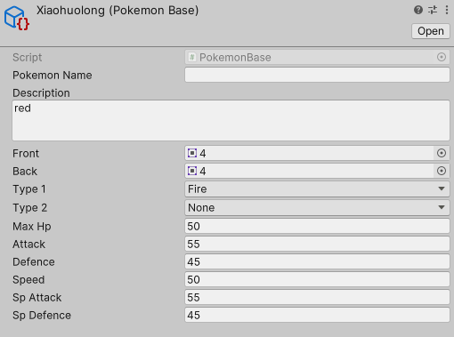

# Csharp

`[System.Serializable]` 使得自定义类可序列化.

# 添加精灵

PokemonBase是用来快速创建游戏对象的模板类. 为了实现这点:

``` org
1. 继承 ~ScriptableObject~
2. 整个类用 ~[CreateAssetMenu(fileName = "Pokemon", menuName = "Pokemon/Create new pokemon")]~ 进行修饰. fileName表示创建出的游戏对象文件的默认名字, menuName表示出现在unity中的右键菜单名.
```

PokemonBase存储的是精灵的固有信息.



Pokemon类代表着此精灵在当前等级下的各种状态.并根据基础能力计算出当前等级的能力值.

# 添加技能

MoveBase类似于上面的PokemonBase, 是一个模板.包含了一个技能的基本信息.
Move则是在战斗中实际的状态

快捷创建变量+get+set的方法:

``` csharp
public MoveBase Base {get; set;}
```

# 创建LearnableMove类, 并为PokemonBase添加可学习技能列表

`Vec<(level,MoveBase)>`

# 为Pokemon类添加当前的技能list.

1.  只能有四个技能.
2.  只能在当前等级\>= 技能的学习等级时添加技能.

# 添加战斗系统UI

创建无功能的空对象作为组合战斗系统要素的

## 添加摄像机

### 设置投影方式: 透视/正交?

## 添加画布

### 为其设置摄像机

### 设置UI缩放方式

### 背景:Image

调整图片大小

### 对话框:Image

1.  设置对话框的图片

    修正图片缩放,不缩放边框

2.  创建对话框的文本

3.  创建空对象作为动作选择器

    1.  分别创建Fight和Run的文本框

4.  创建对话脚本

    每添加一个字符,协程阻塞X毫秒.

5.  技能选择器: 空对象

    1.  创建4个技能:Text.

    2.  添加 Grid Layout

        调整单元大小.

6.  技能详情: 空对象

    1.  PP: 添加一个文本框

        设置锚点为中心

    2.  技能属性: 文本框

7.  禁用除了对话文本之外的所有对象

### 玩家方(敌方)精灵贴图:Image

设置图片

1.  添加BattleUnit脚本

    需要绑定 PokemonBase 和 level. 并根据是玩家/敌方来设置精灵贴图.
    创建一Pokemon对象供Battlehub使用.

### 玩家方(敌方)状态框:Image

修正边框缩放

1.  精灵名字:Text

    为名字设置相对于状态框的左对齐锚点.防止状态框缩放后文字位置错乱.

2.  等级: Text

    对齐状态框框右边缘的锚点

3.  血量条(占位图): Image

    1.  HP文本: Text

        左侧锚点

    2.  血量背景(白): Image

        stretch对齐(向两端伸展)

    3.  血量: Image

        1.  stretch对齐
        2.  设置中心点pivot, 使得缩放时左边缘不动.

    4.  HPBar 脚本

        将脚本分配给 整个血量条; 将血量设置到脚本的health字段.
        调整health字段的缩放

4.  添加BattleHub脚本

    将血量条的各个部分绑定到脚本的变量上. 并从传入Pokemon对象来控制
    名字,等级, 血量..

## 添加BattleSystem脚本

驱动 BattleUnit & BattleHub 脚本

需要获取: 玩家方精灵贴图&状态框; 敌方精灵贴图&状态框;

先初始化BattleUnit(精灵贴图), 再初始化状态框battleHub

使用对话脚本, 设置为XX出现了.

# L8

为战斗对话框添加 `BattleDialogBox` , 使得可以逐个字符显示文本.
并将其加入到 `BattleSystem` 来驱动它.

# L9 实现攻击

在技能选择中按确定, 将关闭技能选择,
并激活对话框文本.显示"xx使用了yy技能" (等待一秒)

在Pokemon中添加一受到指定pokemon的某技能的伤害
