``` makefile
MYASM=test1

default:
    as -o $(MYASM).o $(MYASM).s && ld -o $(MYASM) $(MYASM).o
    @-./$(MYASM) ; echo $$?  # 用-忽略进程退出码!= 0的情况, 打印退出码 .用@不回显这行命令

clean:
    -rm ./*.o
    -rm $(MYASM) 

.PHONY: default clean
```

``` asm
    .global _start        ;程序入口
    .text
_start:
    mov   $60, %rax       
    mov   $1, %rdi ; 进程退出码
    add $1, %rdi
    sub $1, %rdi
    syscall   
```

``` bash
as -o test1.o test1.s && ld -o test1 test1.o

./test1 ; echo $?  
```

运行结果为1

`ld -e foo` 可以指定程序的入口标签

``` asm
    .global foo
    .text
foo:
    mov $60, %rax
    mov $1, %rdi
    syscall 
```

``` bash
as -o test1.o test1.s && ld -e foo -o test1 test1.o
```

函数调用

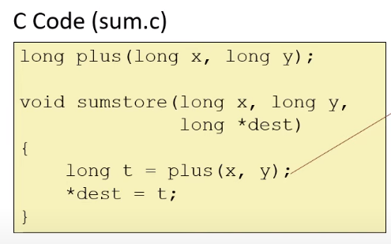

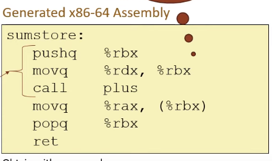

sumstore的三个参数将由调用者提供, 将使用前三个寄存器: x : rdi y : rsi
dest : rdx

首条指令是将 rbx 保存到stack, 防止被覆盖,
因为rbx是一个callee负责保存的寄存器,
这意味着若一个函数需要覆盖它时需要将其保存起来,
并在此函数返回之前将值恢复.

第二条指令将rdx移动到rbx, 即将dest保存到rbx中.
因为rdx是caller负责保存的寄存器,
并且编译器决定将rdx保存到rbx中,而不是stack. 变量x y 仍在rdi和rsi 中,
因此当调用plus时,其参数已经准备好了. 当plus返回后, 返回值存放在rax中.
因此第四行汇编将返回值存入dest指向的位置.

最后两行恢复rbx, 并返回.

等价的代码: 将rdx保存到stack中.

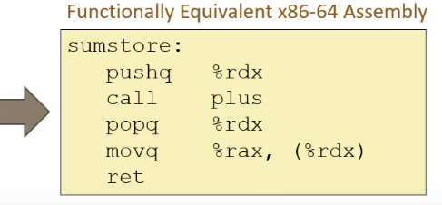

`movq` 中的q表示四字 `quad word` , 一个字 `word` 为16位. 四字为64位.
(x86-64中对word的定义是16位.而其它ISA中可能将word定义为32位)

反汇编目标文件:

``` bash
objdump -d sum > sum.d
```

x86-64 一共有16个 **整数** 寄存器 他们的开头都是 `%r` .

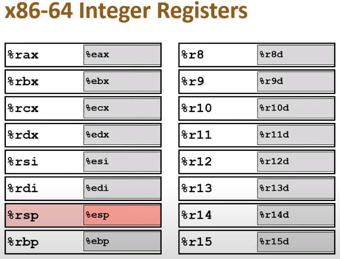

对应的双字(double word)寄存器(一半): 一部分是将 `%r` 替换为 `%e`.
另一部分是加后缀 `d`

``` c
%rbp %rsp ==>  %ebp %esp

%r8 %r15  ==>  %r8d %r15d
```

movq source , dest

source 可以是 imm / register / mem dest 是 reg / mem

source和dest不能同时为mem

有很多表示mem的方式: 最常见的是寄存器寻址: (%rax) 括号类似于解引用\*rax

位移寻址: movq 8(%rbp), %rdx ;; \*(%rbp+8)

一般的寻址形式:

``` cpp
D(base, index, scale) =>  *(base + scale*index + D)

D : 1/2/4字节 ,即 8/16/32
base 任何一个整数寄存器
index 除了rsp之外的15个整数寄存器
scale: 1/2/4/8 
```

地址的计算, 然后对这些地址进行解引用才得到最终结果.
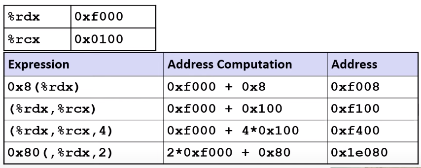


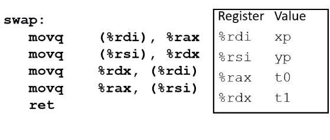

编译器分配了rax rdx这两个 caller保存的寄存器, 来保存函数的临时变量.
caller 保存的寄存器无需保存到stack并从中恢复.

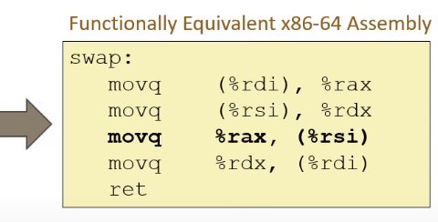

算术&逻辑运算

lea = load effective address

leaq src , dst 用于计算地址, 而不进行 "解引用".
主要目的是生成需要重复使用的地址.

也可以用作一个紧凑的算术运算:

``` c
long m12(long x){
  return x*12;
}
```

可以被编译为:

``` asm
leaq  (%rdi,%rdi,2), %rax ; rax = x + x*2 = 3*x
sal   $2, %rax ; rax = rax << 2 = (3*x)*4 
```

sal为算术左移.

addq src, dest

dest = src + dest

subq src, dest

dest = dest - src

imulq src, dest 对溢出的结果进行截断.

salq/shlq src,dest

dest = dest \<\< src

(算术左移和逻辑左移没有区别)

sarq src , dest dest = dest \>\>\> src
算术右移,最高位补1/0取决于原来的dest的最高位(符号位)

shrq src, dest dest = dest \>\> src 逻辑右移, 最高位补0

xorq src,dest 按位异或. 不同为1, 相同为0

andq src, dst

orq src,dst

单操作数指令

incq dest dest = dest + 1

decq dest dest = dest - 1

negq dest 取相反数 dest = -1\* dest

notq dst dst = ~dst 按位取反

例 : 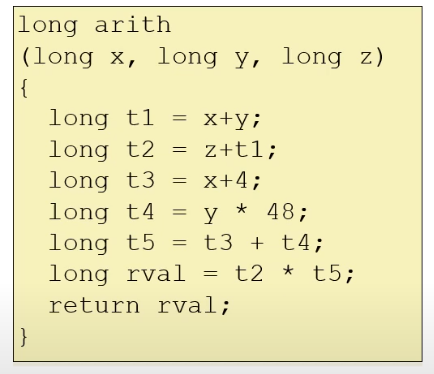

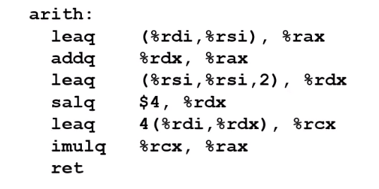

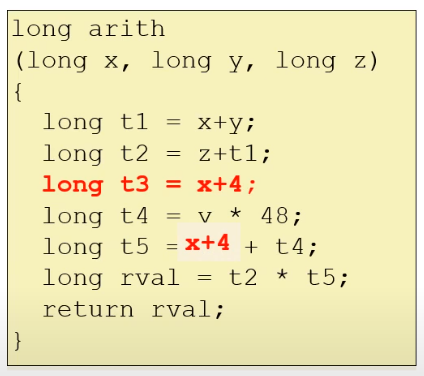

``` asm
rdi = x
rsi = y
rdx = z
```

使用 `leaq` 的好处是不会覆盖掉某些后面还要用的寄存器值.

``` asm
arith:
    leaq (%rdi,%rsi), %rax ;; t1 = x+y
    addq %rdx, %rax  ;; t2 = z+t1

    ;; t4 = y * 48
    ;; 48 = 3*16 = 3 * 2^4 = (1+2) * 2^4
    leaq (%rsi,%rsi,2),%rdx
    salq $4, %rdx

    ;; t3 = x+4
    ;; t5 = t3 + t4 = x + t4 + 4
    leaq 4(%rdi,%rdx), %rcx

    ;; rval = t2 * t5
    ;; return rval
    imulq %rcx %rax
    ret 
```

用位运算实现的abs()

``` c
long abs(long v) {
  long mask = v >> 8 * 8 -1;
  return (v+mask) ^ mask; 
}
```

``` asm
movq %rdi, %rdx  
sarq $63, %rdx ;; mask = v >> 63
leaq (%rdx,%rdi), %rax ;; v + mask 
xorq %rdx, %rax ;; ( v + mask ) ^ mask 
ret       
```

控制流相关指令

控制流指令会改变 %rip, 即程序计数器.

一些条件指令依赖于 eflags 寄存器的值. 其中有四个位是重点关注的:

CF : 无符号溢出 OF : 有符号溢出 SF : 有符号数的符号位 ZF : 是否为零

一些算术/逻辑指令会隐式地改变这些flags:

addq src, dest

CF 若最高位发生进位,则为1 ZF 若结果为零,则为1 SF 若结果\<0, 则为1 OF
若两个有符号数的和发生溢出(a\>0 b\>0 a+b \<0 \|\| a\<0 b\<0 a+b\>0)

cmpq src2, src1 =\> src1 - src2

CF: 最高位发生进位 ZF: src1==src2 SF: src1-src2 \< 0 OF: (src1\>0,
-src2\>0 =\> src1-src2\<0) \|\| (src1\<0,-src2\<0 =\> src1-src2\>0)

testq src2,src1 src1&src2

ZF SF

`testq reg, reg`

可以用来判断 `reg` 的正负(SF ?= 0)

使用分支的绝对值

``` c
long abs(long v) {
  return (v<0)? -v : v ;
}
```

testq实现abs:

``` asm

```

条件move指令: cmov?

用cmovsq实现abs()

``` asm
movq  %rdi, %rax  ;; %rdi = long v
negq  %rax  ;; 目的是设置 SF
cmovsq  %rdi, %rax ;; 有条件的mov: 若SF=1则mov
retq  
```

cmovsq

c: condition s: SF q: quad word

循环的实现:

``` c

```

用系统调用打印字符串:

``` asm
.LC0:
    .string "hello\n" 

    .text
    .global _start
_start:
    movq $1,%rax  ;; 1号系统调用  sys_write
    movq $1,%rdi  ;; fd == stdout == 1 
    movq $.LC0, %rsi 
    movq $7, %rdx ;; 字符串长度(包含尾零) 
    syscall

    movq $60, %rax ;; 60号系统调用, exit
    movq $0, %rdi  ;; (参数)退出码为 0 
    syscall
```

合法的栈地址 \>= rsp 因此rsp所指位置是有数据的.

- pushq src

rsp - 8字节

- pop

<!-- -->

- call label

  push rip && jump label

- retq pop rip

函数调用约定:(system V)

- 返回值放在 `%rax` .长度在 64 - 128 之间的放在 `%rdx:%rax` 中
  浮点类型的返回值 `xmm` 更大的类型(eg结构体)放在栈中 ,
  也可以通过rax中存放指针进行返回.

- 前6个参数 :(长度\<4字)

`%rdi, %rsi, %rdx, %rcx, %r8, %r9`

- 剩下的参数/长度大于四字 放在stack中 :

反向入栈: 后面的参数先入栈.

- 随后call将返回地址rip压入栈

caller-saved: 在函数中修改后不负责还原,
因此caller调用别的函数之前自己要保存好(存放到stack/callee-saved寄存器)

``` bash
%rax, %rcx, %rdx, %rsi, %rdi,
%r8, %r9, %r10, %11
```

callee-saved: 函数中修改后要负责还原

``` bash
%rbx, %rsp, %rbp,
%r12, %r13, %14, %15
```

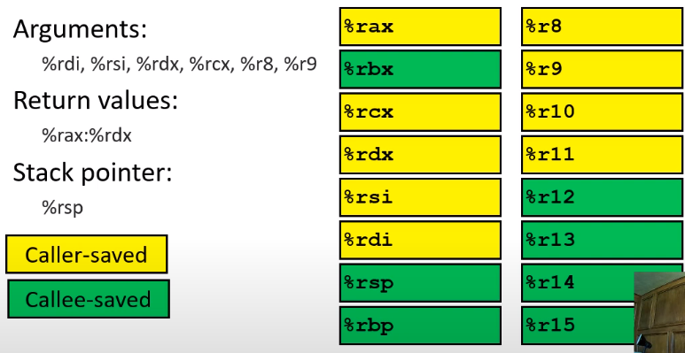
